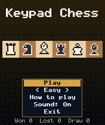
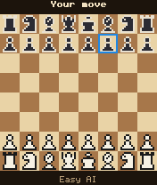
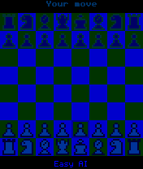

# Keypad Chess

 **Board** &middot; Game 005 of 100 &middot; v1.0.0

> Full-rules chess against an alpha-beta AI with three strengths, played entirely on the keypad.

<p>  </p>

<sub>Screenshots at 176x208, captured from the real JAR on the project's reference runtime.</sub>

## About

Complete chess rules - castling, en passant, promotion, check, checkmate, stalemate, the 50-move rule and insufficient material - with an integer-only alpha-beta search tuned for handset CPUs. Easy looks one move ahead with some randomness, Normal searches two plies plus captures, Hard searches three plies plus captures. Legal moves are highlighted, and your win/loss/draw record is saved on the phone.

**Objective:** Checkmate the computer's king.

**Modes:** Easy, Normal, Hard

## Controls

| Key | Action |
|---|---|
| 2/4/6/8 | Move cursor |
| 1/3/7/9 | Move diagonally |
| 5 | Select piece / move |
| 0 | Cancel selection |
| * | Pause menu |

Every game also supports: `5` to select in menus, `*` to pause, `0` on the title screen to toggle sound, and `#` on the title screen for help. Joystick/D-pad and the 2/4/6/8 keys are interchangeable.

## Download

| File | Link |
|---|---|
| JAR (install this) | [KeypadChess.jar](https://github.com/agneay/j2me-100-games/releases/download/game-005-v1.0.0/KeypadChess.jar) |
| JAD (descriptor for OTA install) | [KeypadChess.jad](https://github.com/agneay/j2me-100-games/releases/download/game-005-v1.0.0/KeypadChess.jad) |
| Release page | [game-005-v1.0.0](https://github.com/agneay/j2me-100-games/releases/tag/game-005-v1.0.0) |
| All 100 games | [j2me-100-games-v1.0.0.zip](https://github.com/agneay/j2me-100-games/releases/download/v1.0.0/j2me-100-games-v1.0.0.zip) |

**Browser Demo:** [play in your browser](https://agneay.github.io/j2me-100-games/games/keypad-chess/). The browser demo is the same Java source compiled to JavaScript with TeaVM and run on the project's MIDP reference runtime; it is a convenience preview, not the original Java ME version. For the authentic experience install the JAR on a phone or in an emulator.

Installation help: [docs/installing.md](../../docs/installing.md) and [docs/emulator.md](../../docs/emulator.md).

## Technical details

| | |
|---|---|
| MIDlet class | `keypadchess.KeypadChessMIDlet` |
| Platform | Java ME, CLDC 1.0, MIDP 2.0 |
| JAR size | 21.6 KB |
| Designed for | 128x128, 128x160, 176x208, 176x220, 240x320 |
| Storage | RMS record store `gk` (settings and best score) |
| Floating point | none (integer maths only) |

## Verification

| Level | Status |
|---|---|
| Build verified | Yes: compiled against the CLDC 1.0 / MIDP 2.0 API, JAR + JAD generated |
| Reference runtime | Passed at 128x128, 128x160, 176x208, 176x220, 240x320 (automated, project's headless MIDP runtime) |
| Emulator verified | Yes: automated smoke test on MicroEmulator 2.0.4 (176x220) |
| Real device verified | Not yet tested on real hardware |

Tested it on a real phone? Please [report it](https://github.com/agneay/j2me-100-games/issues/new?template=device-report.yml) so this table can be updated honestly.

## Build from source

```bash
python tools/bootstrap.py
tools/build-game.sh 005
```

Output: `games/005-keypad-chess/dist/KeypadChess.jar` and `.jad`. See [docs/building.md](../../docs/building.md).

---

Part of [J2ME 100 Games](../../README.md). Original game, released under the [MIT License](../../LICENSE).
