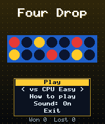
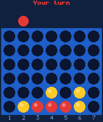
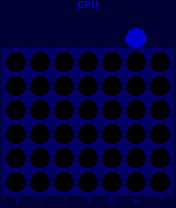

# Four Drop

 **Board** &middot; Game 013 of 100 &middot; v1.0.0

> Drop discs into a seven-column grid and line up four before your opponent - against the CPU or a friend.

<p>  </p>

<sub>Screenshots at 176x208, captured from the real JAR on the project's reference runtime.</sub>

## About

The vertical four-in-a-row game built for the keypad: press 1-7 to drop straight into a column, or steer with the joystick. The CPU uses alpha-beta search with a window-scoring evaluation at depth 2, 4 or 6, and a hot-seat mode lets two people share one phone. The starting player alternates every game and your record against the CPU is saved.

**Objective:** Connect four of your discs in a row - horizontally, vertically or diagonally.

**Modes:** vs CPU Easy, vs CPU Normal, vs CPU Hard, 2 Players

## Controls

| Key | Action |
|---|---|
| 1-7 | Drop disc in that column |
| Joystick left/right | Move cursor |
| Select | Drop at cursor |
| * | Pause menu |

Every game also supports: `5` to select in menus, `*` to pause, `0` on the title screen to toggle sound, and `#` on the title screen for help. Joystick/D-pad and the 2/4/6/8 keys are interchangeable.

## Download

| File | Link |
|---|---|
| JAR (install this) | [FourDrop.jar](https://github.com/agneay/j2me-100-games/releases/download/game-013-v1.0.0/FourDrop.jar) |
| JAD (descriptor for OTA install) | [FourDrop.jad](https://github.com/agneay/j2me-100-games/releases/download/game-013-v1.0.0/FourDrop.jad) |
| Release page | [game-013-v1.0.0](https://github.com/agneay/j2me-100-games/releases/tag/game-013-v1.0.0) |
| All 100 games | [j2me-100-games-v1.0.0.zip](https://github.com/agneay/j2me-100-games/releases/download/v1.0.0/j2me-100-games-v1.0.0.zip) |

**Browser Demo:** [play in your browser](https://agneay.github.io/j2me-100-games/games/four-drop/). The browser demo is the same Java source compiled to JavaScript with TeaVM and run on the project's MIDP reference runtime; it is a convenience preview, not the original Java ME version. For the authentic experience install the JAR on a phone or in an emulator.

Installation help: [docs/installing.md](../../docs/installing.md) and [docs/emulator.md](../../docs/emulator.md).

## Technical details

| | |
|---|---|
| MIDlet class | `fourdrop.FourDropMIDlet` |
| Platform | Java ME, CLDC 1.0, MIDP 2.0 |
| JAR size | 18.2 KB |
| Designed for | 128x128, 128x160, 176x208, 176x220, 240x320 |
| Storage | RMS record store `gk` (settings and best score) |
| Floating point | none (integer maths only) |

## Verification

| Level | Status |
|---|---|
| Build verified | Yes: compiled against the CLDC 1.0 / MIDP 2.0 API, JAR + JAD generated |
| Reference runtime | Passed at 128x128, 128x160, 176x208, 176x220, 240x320 (automated, project's headless MIDP runtime) |
| Emulator verified | Yes: automated smoke test on MicroEmulator 2.0.4 (176x220) |
| Real device verified | Not yet tested on real hardware |

Tested it on a real phone? Please [report it](https://github.com/agneay/j2me-100-games/issues/new?template=device-report.yml) so this table can be updated honestly.

## Build from source

```bash
python tools/bootstrap.py
tools/build-game.sh 013
```

Output: `games/013-four-drop/dist/FourDrop.jar` and `.jad`. See [docs/building.md](../../docs/building.md).

---

Part of [J2ME 100 Games](../../README.md). Original game, released under the [MIT License](../../LICENSE).
