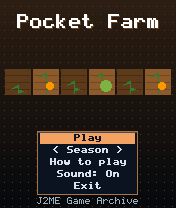
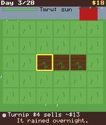
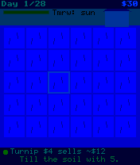

# Pocket Farm

 **Simulation** &middot; Game 017 of 100 &middot; v1.0.0

> Till, plant, water and harvest a 30-plot field and earn $1000 before the 28-day season ends.

<p>  </p>

<sub>Screenshots at 176x208, captured from the real JAR on the project's reference runtime.</sub>

## About

A bite-sized farming sim driven by one context key: 5 tills, plants, waters or harvests depending on the plot. Four crops with different growth times and prices, daily market swings, an energy budget that forces you to sleep, rain forecasts that save you a watering run, and crops that wither if left dry for three days. Play the 28-day Season challenge or farm forever in Endless mode.

**Objective:** Earn $1000 within the 28-day season.

**Modes:** Season (28 days), Endless

## Controls

| Key | Action |
|---|---|
| 2/4/6/8 | Move between plots |
| 5 | Till / plant / water / harvest |
| 0 | Change seed type |
| # | Sleep (next day) |
| * | Pause menu |

Every game also supports: `5` to select in menus, `*` to pause, `0` on the title screen to toggle sound, and `#` on the title screen for help. Joystick/D-pad and the 2/4/6/8 keys are interchangeable.

## Download

| File | Link |
|---|---|
| JAR (install this) | [PocketFarm.jar](https://github.com/agneay/j2me-100-games/releases/download/game-017-v1.0.0/PocketFarm.jar) |
| JAD (descriptor for OTA install) | [PocketFarm.jad](https://github.com/agneay/j2me-100-games/releases/download/game-017-v1.0.0/PocketFarm.jad) |
| Release page | [game-017-v1.0.0](https://github.com/agneay/j2me-100-games/releases/tag/game-017-v1.0.0) |
| All 100 games | [j2me-100-games-v1.0.0.zip](https://github.com/agneay/j2me-100-games/releases/download/v1.0.0/j2me-100-games-v1.0.0.zip) |

**Browser Demo:** [play in your browser](https://agneay.github.io/j2me-100-games/games/pocket-farm/). The browser demo is the same Java source compiled to JavaScript with TeaVM and run on the project's MIDP reference runtime; it is a convenience preview, not the original Java ME version. For the authentic experience install the JAR on a phone or in an emulator.

Installation help: [docs/installing.md](../../docs/installing.md) and [docs/emulator.md](../../docs/emulator.md).

## Technical details

| | |
|---|---|
| MIDlet class | `pocketfarm.PocketFarmMIDlet` |
| Platform | Java ME, CLDC 1.0, MIDP 2.0 |
| JAR size | 18.4 KB |
| Designed for | 128x128, 128x160, 176x208, 176x220, 240x320 |
| Storage | RMS record store `gk` (settings and best score) |
| Floating point | none (integer maths only) |

## Verification

| Level | Status |
|---|---|
| Build verified | Yes: compiled against the CLDC 1.0 / MIDP 2.0 API, JAR + JAD generated |
| Reference runtime | Passed at 128x128, 128x160, 176x208, 176x220, 240x320 (automated, project's headless MIDP runtime) |
| Emulator verified | Yes: automated smoke test on MicroEmulator 2.0.4 (176x220) |
| Real device verified | Not yet tested on real hardware |

Tested it on a real phone? Please [report it](https://github.com/agneay/j2me-100-games/issues/new?template=device-report.yml) so this table can be updated honestly.

## Build from source

```bash
python tools/bootstrap.py
tools/build-game.sh 017
```

Output: `games/017-pocket-farm/dist/PocketFarm.jar` and `.jad`. See [docs/building.md](../../docs/building.md).

---

Part of [J2ME 100 Games](../../README.md). Original game, released under the [MIT License](../../LICENSE).
