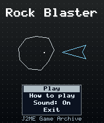
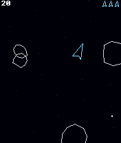
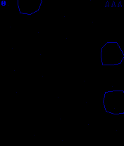

# Rock Blaster

 **Arcade** &middot; Game 019 of 100 &middot; v1.0.0

> Pilot a drifting vector ship through wrap-around space, splitting tumbling rocks and dodging a sharpshooting saucer.

<p>  </p>

<sub>Screenshots at 176x208, captured from the real JAR on the project's reference runtime.</sub>

## About

Inertia-based space shooting drawn entirely with lines. Rotate with 4/6, thrust with 2 and fire with 5 while rocks split from large to medium to small. A saucer cruises through and aims at you, hyperspace is an emergency escape that might land you somewhere worse, and every 10000 points earns an extra ship. All physics use fixed-point integer maths for old handsets.

**Objective:** Clear wave after wave of rocks and survive as long as possible.

## Controls

| Key | Action |
|---|---|
| 4/6 | Rotate |
| 2 | Thrust |
| 5 | Fire |
| 8/0 | Hyperspace |
| * | Pause menu |

Every game also supports: `5` to select in menus, `*` to pause, `0` on the title screen to toggle sound, and `#` on the title screen for help. Joystick/D-pad and the 2/4/6/8 keys are interchangeable.

## Download

| File | Link |
|---|---|
| JAR (install this) | [RockBlaster.jar](https://github.com/agneay/j2me-100-games/releases/download/game-019-v1.0.0/RockBlaster.jar) |
| JAD (descriptor for OTA install) | [RockBlaster.jad](https://github.com/agneay/j2me-100-games/releases/download/game-019-v1.0.0/RockBlaster.jad) |
| Release page | [game-019-v1.0.0](https://github.com/agneay/j2me-100-games/releases/tag/game-019-v1.0.0) |
| All 100 games | [j2me-100-games-v1.0.0.zip](https://github.com/agneay/j2me-100-games/releases/download/v1.0.0/j2me-100-games-v1.0.0.zip) |

**Browser Demo:** [play in your browser](https://agneay.github.io/j2me-100-games/games/rock-blaster/). The browser demo is the same Java source compiled to JavaScript with TeaVM and run on the project's MIDP reference runtime; it is a convenience preview, not the original Java ME version. For the authentic experience install the JAR on a phone or in an emulator.

Installation help: [docs/installing.md](../../docs/installing.md) and [docs/emulator.md](../../docs/emulator.md).

## Technical details

| | |
|---|---|
| MIDlet class | `rockblaster.RockBlasterMIDlet` |
| Platform | Java ME, CLDC 1.0, MIDP 2.0 |
| JAR size | 18.3 KB |
| Designed for | 128x128, 128x160, 176x208, 176x220, 240x320 |
| Storage | RMS record store `gk` (settings and best score) |
| Floating point | none (integer maths only) |

## Verification

| Level | Status |
|---|---|
| Build verified | Yes: compiled against the CLDC 1.0 / MIDP 2.0 API, JAR + JAD generated |
| Reference runtime | Passed at 128x128, 128x160, 176x208, 176x220, 240x320 (automated, project's headless MIDP runtime) |
| Emulator verified | Yes: automated smoke test on MicroEmulator 2.0.4 (176x220) |
| Real device verified | Not yet tested on real hardware |

Tested it on a real phone? Please [report it](https://github.com/agneay/j2me-100-games/issues/new?template=device-report.yml) so this table can be updated honestly.

## Build from source

```bash
python tools/bootstrap.py
tools/build-game.sh 019
```

Output: `games/019-rock-blaster/dist/RockBlaster.jar` and `.jad`. See [docs/building.md](../../docs/building.md).

---

Part of [J2ME 100 Games](../../README.md). Original game, released under the [MIT License](../../LICENSE).
