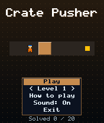
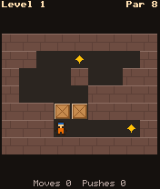
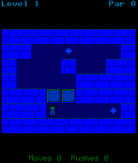

# Crate Pusher

 **Puzzle** &middot; Game 020 of 100 &middot; v1.0.0

> Push crates onto targets in 20 original warehouse puzzles, each verified solvable with a known minimum push count.

<p>  </p>

<sub>Screenshots at 176x208, captured from the real JAR on the project's reference runtime.</sub>

## About

A box-pushing logic puzzle with 20 original levels produced by a reverse-play generator and checked by a breadth-first solver, which also supplies the par (fewest possible pushes) shown for every level. Unlimited undo, instant restart, saved progress and free choice of any unlocked level from the title screen.

**Objective:** Push every crate onto a target square. Try to match the par push count.

**Modes:** Level 1..20 (unlocked as you go)

## Controls

| Key | Action |
|---|---|
| 2/4/6/8 | Walk / push |
| 0 | Undo move |
| # | Restart level |
| * | Pause menu |

Every game also supports: `5` to select in menus, `*` to pause, `0` on the title screen to toggle sound, and `#` on the title screen for help. Joystick/D-pad and the 2/4/6/8 keys are interchangeable.

## Download

| File | Link |
|---|---|
| JAR (install this) | [CratePusher.jar](https://github.com/agneay/j2me-100-games/releases/download/game-020-v1.0.0/CratePusher.jar) |
| JAD (descriptor for OTA install) | [CratePusher.jad](https://github.com/agneay/j2me-100-games/releases/download/game-020-v1.0.0/CratePusher.jad) |
| Release page | [game-020-v1.0.0](https://github.com/agneay/j2me-100-games/releases/tag/game-020-v1.0.0) |
| All 100 games | [j2me-100-games-v1.0.0.zip](https://github.com/agneay/j2me-100-games/releases/download/v1.0.0/j2me-100-games-v1.0.0.zip) |

**Browser Demo:** [play in your browser](https://agneay.github.io/j2me-100-games/games/crate-pusher/). The browser demo is the same Java source compiled to JavaScript with TeaVM and run on the project's MIDP reference runtime; it is a convenience preview, not the original Java ME version. For the authentic experience install the JAR on a phone or in an emulator.

Installation help: [docs/installing.md](../../docs/installing.md) and [docs/emulator.md](../../docs/emulator.md).

## Technical details

| | |
|---|---|
| MIDlet class | `cratepusher.CratePusherMIDlet` |
| Platform | Java ME, CLDC 1.0, MIDP 2.0 |
| JAR size | 19.4 KB |
| Designed for | 128x128, 128x160, 176x208, 176x220, 240x320 |
| Storage | RMS record store `gk` (settings and best score) |
| Floating point | none (integer maths only) |

## Verification

| Level | Status |
|---|---|
| Build verified | Yes: compiled against the CLDC 1.0 / MIDP 2.0 API, JAR + JAD generated |
| Reference runtime | Passed at 128x128, 128x160, 176x208, 176x220, 240x320 (automated, project's headless MIDP runtime) |
| Emulator verified | Yes: automated smoke test on MicroEmulator 2.0.4 (176x220) |
| Real device verified | Not yet tested on real hardware |

Tested it on a real phone? Please [report it](https://github.com/agneay/j2me-100-games/issues/new?template=device-report.yml) so this table can be updated honestly.

## Build from source

```bash
python tools/bootstrap.py
tools/build-game.sh 020
```

Output: `games/020-crate-pusher/dist/CratePusher.jar` and `.jad`. See [docs/building.md](../../docs/building.md).

---

Part of [J2ME 100 Games](../../README.md). Original game, released under the [MIT License](../../LICENSE).
