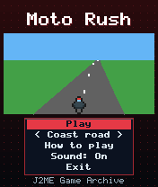
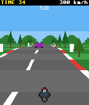
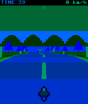

# Moto Rush

 **Racing** &middot; Game 023 of 100 &middot; v1.0.0

> A pseudo-3D motorbike race down a winding, rolling highway against the clock.

<p>  </p>

<sub>Screenshots at 176x208, captured from the real JAR on the project's reference runtime.</sub>

## About

Classic sprite-scaler racing rendered with nothing but triangles and integer maths: a 600-segment road with eased curves and hills, alternating rumble strips, roadside trees and posts, and slower traffic to weave through. Curves push you outward, grass slows you down, collisions send you sliding, and each checkpoint adds time. Two tracks: the gentle Coast road and the steep, twisty Mountain pass.

**Objective:** Ride as far as possible, reaching each checkpoint before the timer hits zero.

**Modes:** Coast road, Mountain pass

## Controls

| Key | Action |
|---|---|
| 2/5 | Throttle |
| 8 | Brake |
| 4/6 | Steer |
| * | Pause menu |

Every game also supports: `5` to select in menus, `*` to pause, `0` on the title screen to toggle sound, and `#` on the title screen for help. Joystick/D-pad and the 2/4/6/8 keys are interchangeable.

## Download

| File | Link |
|---|---|
| JAR (install this) | [MotoRush.jar](https://github.com/agneay/j2me-100-games/releases/download/game-023-v1.0.0/MotoRush.jar) |
| JAD (descriptor for OTA install) | [MotoRush.jad](https://github.com/agneay/j2me-100-games/releases/download/game-023-v1.0.0/MotoRush.jad) |
| Release page | [game-023-v1.0.0](https://github.com/agneay/j2me-100-games/releases/tag/game-023-v1.0.0) |
| All 100 games | [j2me-100-games-v1.0.0.zip](https://github.com/agneay/j2me-100-games/releases/download/v1.0.0/j2me-100-games-v1.0.0.zip) |

**Browser Demo:** [play in your browser](https://agneay.github.io/j2me-100-games/games/moto-rush/). The browser demo is the same Java source compiled to JavaScript with TeaVM and run on the project's MIDP reference runtime; it is a convenience preview, not the original Java ME version. For the authentic experience install the JAR on a phone or in an emulator.

Installation help: [docs/installing.md](../../docs/installing.md) and [docs/emulator.md](../../docs/emulator.md).

## Technical details

| | |
|---|---|
| MIDlet class | `motorush.MotoRushMIDlet` |
| Platform | Java ME, CLDC 1.0, MIDP 2.0 |
| JAR size | 19.0 KB |
| Designed for | 128x128, 128x160, 176x208, 176x220, 240x320 |
| Storage | RMS record store `gk` (settings and best score) |
| Floating point | none (integer maths only) |

## Verification

| Level | Status |
|---|---|
| Build verified | Yes: compiled against the CLDC 1.0 / MIDP 2.0 API, JAR + JAD generated |
| Reference runtime | Passed at 128x128, 128x160, 176x208, 176x220, 240x320 (automated, project's headless MIDP runtime) |
| Emulator verified | Yes: automated smoke test on MicroEmulator 2.0.4 (176x220) |
| Real device verified | Not yet tested on real hardware |

Tested it on a real phone? Please [report it](https://github.com/agneay/j2me-100-games/issues/new?template=device-report.yml) so this table can be updated honestly.

## Build from source

```bash
python tools/bootstrap.py
tools/build-game.sh 023
```

Output: `games/023-moto-rush/dist/MotoRush.jar` and `.jad`. See [docs/building.md](../../docs/building.md).

---

Part of [J2ME 100 Games](../../README.md). Original game, released under the [MIT License](../../LICENSE).
