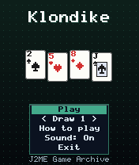
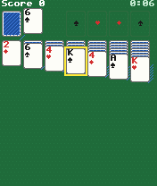
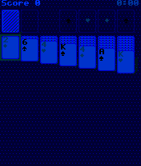

# Klondike

 **Card** &middot; Game 025 of 100 &middot; v1.0.0

> The classic patience game: build four suits from Ace to King, with Draw 1 and Draw 3 rules.

<p>  </p>

<sub>Screenshots at 176x208, captured from the real JAR on the project's reference runtime.</sub>

## About

Full Klondike solitaire designed for a joystick or the 2/4/6/8 keys. A single cursor walks the stock, waste, foundations and seven columns; pressing 2 inside a column grows the selection to pick up a whole run. Press # to fling a card to its foundation, and once every card is face-up the game finishes itself automatically. Long columns compress to fit even a 128-pixel screen.

**Objective:** Move all 52 cards onto the four foundations.

**Modes:** Draw 1, Draw 3

## Controls

| Key | Action |
|---|---|
| 4/6 | Move cursor |
| 2/8 | Change row / grow or shrink run selection |
| 5 | Pick up / drop / turn stock |
| # | Send card to foundation |
| 0 | Cancel pick-up |
| * | Pause menu |

Every game also supports: `5` to select in menus, `*` to pause, `0` on the title screen to toggle sound, and `#` on the title screen for help. Joystick/D-pad and the 2/4/6/8 keys are interchangeable.

## Download

| File | Link |
|---|---|
| JAR (install this) | [Klondike.jar](https://github.com/agneay/j2me-100-games/releases/download/game-025-v1.0.0/Klondike.jar) |
| JAD (descriptor for OTA install) | [Klondike.jad](https://github.com/agneay/j2me-100-games/releases/download/game-025-v1.0.0/Klondike.jad) |
| Release page | [game-025-v1.0.0](https://github.com/agneay/j2me-100-games/releases/tag/game-025-v1.0.0) |
| All 100 games | [j2me-100-games-v1.0.0.zip](https://github.com/agneay/j2me-100-games/releases/download/v1.0.0/j2me-100-games-v1.0.0.zip) |

**Browser Demo:** [play in your browser](https://agneay.github.io/j2me-100-games/games/klondike/). The browser demo is the same Java source compiled to JavaScript with TeaVM and run on the project's MIDP reference runtime; it is a convenience preview, not the original Java ME version. For the authentic experience install the JAR on a phone or in an emulator.

Installation help: [docs/installing.md](../../docs/installing.md) and [docs/emulator.md](../../docs/emulator.md).

## Technical details

| | |
|---|---|
| MIDlet class | `klondike.KlondikeMIDlet` |
| Platform | Java ME, CLDC 1.0, MIDP 2.0 |
| JAR size | 20.4 KB |
| Designed for | 128x128, 128x160, 176x208, 176x220, 240x320 |
| Storage | RMS record store `gk` (settings and best score) |
| Floating point | none (integer maths only) |

## Verification

| Level | Status |
|---|---|
| Build verified | Yes: compiled against the CLDC 1.0 / MIDP 2.0 API, JAR + JAD generated |
| Reference runtime | Passed at 128x128, 128x160, 176x208, 176x220, 240x320 (automated, project's headless MIDP runtime) |
| Emulator verified | Yes: automated smoke test on MicroEmulator 2.0.4 (176x220) |
| Real device verified | Not yet tested on real hardware |

Tested it on a real phone? Please [report it](https://github.com/agneay/j2me-100-games/issues/new?template=device-report.yml) so this table can be updated honestly.

## Build from source

```bash
python tools/bootstrap.py
tools/build-game.sh 025
```

Output: `games/025-klondike/dist/Klondike.jar` and `.jad`. See [docs/building.md](../../docs/building.md).

---

Part of [J2ME 100 Games](../../README.md). Original game, released under the [MIT License](../../LICENSE).
