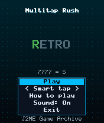
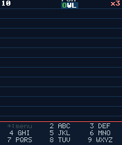
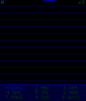

# Multitap Rush

 **Experimental** &middot; Game 029 of 100 &middot; v1.0.0

> Type falling words with old-school multi-tap texting (press 2 three times for C) before they hit the ground.

<p>  </p>

<sub>Screenshots at 176x208, captured from the real JAR on the project's reference runtime.</sub>

## About

A typing game that only makes sense on a phone keypad. Words rain down and you spell them with the letters printed on the number keys. Smart mode accepts each letter the instant you reach it on the key, so it is a pure speed test; Classic mode is authentic multi-tap where you pause or switch keys to confirm, and mistakes break your combo. Longer words unlock as you go.

**Objective:** Type as many words as possible before three of them reach the ground.

**Modes:** Smart tap, Classic multitap

## Controls

| Key | Action |
|---|---|
| 2-9 | Multi-tap letters (2 ABC ... 9 WXYZ) |
| 0/# | Confirm letter (Classic mode) |
| * | Pause menu |

Every game also supports: `5` to select in menus, `*` to pause, `0` on the title screen to toggle sound, and `#` on the title screen for help. Joystick/D-pad and the 2/4/6/8 keys are interchangeable.

## Download

| File | Link |
|---|---|
| JAR (install this) | [MultitapRush.jar](https://github.com/agneay/j2me-100-games/releases/download/game-029-v1.0.0/MultitapRush.jar) |
| JAD (descriptor for OTA install) | [MultitapRush.jad](https://github.com/agneay/j2me-100-games/releases/download/game-029-v1.0.0/MultitapRush.jad) |
| Release page | [game-029-v1.0.0](https://github.com/agneay/j2me-100-games/releases/tag/game-029-v1.0.0) |
| All 100 games | [j2me-100-games-v1.0.0.zip](https://github.com/agneay/j2me-100-games/releases/download/v1.0.0/j2me-100-games-v1.0.0.zip) |

**Browser Demo:** [play in your browser](https://agneay.github.io/j2me-100-games/games/multitap-rush/). The browser demo is the same Java source compiled to JavaScript with TeaVM and run on the project's MIDP reference runtime; it is a convenience preview, not the original Java ME version. For the authentic experience install the JAR on a phone or in an emulator.

Installation help: [docs/installing.md](../../docs/installing.md) and [docs/emulator.md](../../docs/emulator.md).

## Technical details

| | |
|---|---|
| MIDlet class | `multitaprush.MultitapRushMIDlet` |
| Platform | Java ME, CLDC 1.0, MIDP 2.0 |
| JAR size | 18.3 KB |
| Designed for | 128x128, 128x160, 176x208, 176x220, 240x320 |
| Storage | RMS record store `gk` (settings and best score) |
| Floating point | none (integer maths only) |

## Verification

| Level | Status |
|---|---|
| Build verified | Yes: compiled against the CLDC 1.0 / MIDP 2.0 API, JAR + JAD generated |
| Reference runtime | Passed at 128x128, 128x160, 176x208, 176x220, 240x320 (automated, project's headless MIDP runtime) |
| Emulator verified | Yes: automated smoke test on MicroEmulator 2.0.4 (176x220) |
| Real device verified | Not yet tested on real hardware |

Tested it on a real phone? Please [report it](https://github.com/agneay/j2me-100-games/issues/new?template=device-report.yml) so this table can be updated honestly.

## Build from source

```bash
python tools/bootstrap.py
tools/build-game.sh 029
```

Output: `games/029-multitap-rush/dist/MultitapRush.jar` and `.jad`. See [docs/building.md](../../docs/building.md).

---

Part of [J2ME 100 Games](../../README.md). Original game, released under the [MIT License](../../LICENSE).
