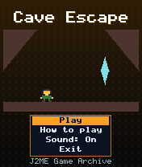
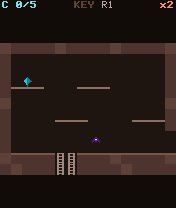
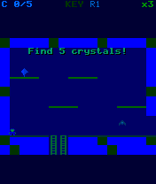

# Cave Escape

 **Platformer** &middot; Game 033 of 100 &middot; v1.0.0

> Explore six flip-screen caverns, climb ladders, collect five crystals and find the key to escape.

<p>  </p>

<sub>Screenshots at 176x208, captured from the real JAR on the project's reference runtime.</sub>

## About

A compact flip-screen exploration platformer in the style of 8-bit cave games. Walk off a screen edge to reach the next cavern, climb ladders between levels, dodge swooping bats and floor spikes, and gather the five crystals. An iron door guards the exit and only opens for the key. Your fastest escape time is saved.

**Objective:** Collect all five crystals and the key, open the door and reach the exit as fast as you can.

## Controls

| Key | Action |
|---|---|
| 4/6 | Walk |
| 5 | Jump |
| 2/8 | Climb ladders / drop down |
| 1/3 | Jump left / right |
| * | Pause menu |

Every game also supports: `5` to select in menus, `*` to pause, `0` on the title screen to toggle sound, and `#` on the title screen for help. Joystick/D-pad and the 2/4/6/8 keys are interchangeable.

## Download

| File | Link |
|---|---|
| JAR (install this) | [CaveEscape.jar](https://github.com/agneay/j2me-100-games/releases/download/game-033-v1.0.0/CaveEscape.jar) |
| JAD (descriptor for OTA install) | [CaveEscape.jad](https://github.com/agneay/j2me-100-games/releases/download/game-033-v1.0.0/CaveEscape.jad) |
| Release page | [game-033-v1.0.0](https://github.com/agneay/j2me-100-games/releases/tag/game-033-v1.0.0) |
| All 100 games | [j2me-100-games-v1.0.0.zip](https://github.com/agneay/j2me-100-games/releases/download/v1.0.0/j2me-100-games-v1.0.0.zip) |

**Browser Demo:** [play in your browser](https://agneay.github.io/j2me-100-games/games/cave-escape/). The browser demo is the same Java source compiled to JavaScript with TeaVM and run on the project's MIDP reference runtime; it is a convenience preview, not the original Java ME version. For the authentic experience install the JAR on a phone or in an emulator.

Installation help: [docs/installing.md](../../docs/installing.md) and [docs/emulator.md](../../docs/emulator.md).

## Technical details

| | |
|---|---|
| MIDlet class | `caveescape.CaveEscapeMIDlet` |
| Platform | Java ME, CLDC 1.0, MIDP 2.0 |
| JAR size | 21.7 KB |
| Designed for | 128x128, 128x160, 176x208, 176x220, 240x320 |
| Storage | RMS record store `gk` (settings and best score) |
| Floating point | none (integer maths only) |

## Verification

| Level | Status |
|---|---|
| Build verified | Yes: compiled against the CLDC 1.0 / MIDP 2.0 API, JAR + JAD generated |
| Reference runtime | Passed at 128x128, 128x160, 176x208, 176x220, 240x320 (automated, project's headless MIDP runtime) |
| Emulator verified | Yes: automated smoke test on MicroEmulator 2.0.4 (176x220) |
| Real device verified | Not yet tested on real hardware |

Tested it on a real phone? Please [report it](https://github.com/agneay/j2me-100-games/issues/new?template=device-report.yml) so this table can be updated honestly.

## Build from source

```bash
python tools/bootstrap.py
tools/build-game.sh 033
```

Output: `games/033-cave-escape/dist/CaveEscape.jar` and `.jad`. See [docs/building.md](../../docs/building.md).

---

Part of [J2ME 100 Games](../../README.md). Original game, released under the [MIT License](../../LICENSE).
