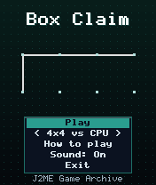
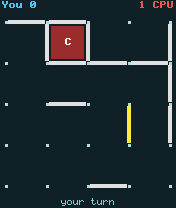
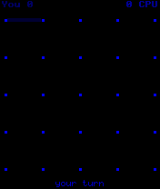

# Box Claim

 **Strategy** &middot; Game 035 of 100 &middot; v1.0.0

> Dots and boxes: draw lines, complete boxes to claim them, and avoid handing your opponent a chain.

<p>  </p>

<sub>Screenshots at 176x208, captured from the real JAR on the project's reference runtime.</sub>

## About

The pencil-and-paper classic on a 4x4 or 5x5 board. The cursor glides between the lines of the grid, completed boxes are stamped with their owner and the last line drawn is highlighted. The standard CPU grabs free boxes and avoids giving away third sides; the Smart CPU also simulates how many boxes each forced move would hand you and picks the cheapest. Two players can share the phone too.

**Objective:** Claim more boxes than your opponent.

**Modes:** 4x4 vs CPU, 5x5 vs CPU, 5x5 vs Smart CPU, 4x4 2 Players

## Controls

| Key | Action |
|---|---|
| 2/4/6/8 | Move between lines |
| 5 | Draw line |
| * | Pause menu |

Every game also supports: `5` to select in menus, `*` to pause, `0` on the title screen to toggle sound, and `#` on the title screen for help. Joystick/D-pad and the 2/4/6/8 keys are interchangeable.

## Download

| File | Link |
|---|---|
| JAR (install this) | [BoxClaim.jar](https://github.com/agneay/j2me-100-games/releases/download/game-035-v1.0.0/BoxClaim.jar) |
| JAD (descriptor for OTA install) | [BoxClaim.jad](https://github.com/agneay/j2me-100-games/releases/download/game-035-v1.0.0/BoxClaim.jad) |
| Release page | [game-035-v1.0.0](https://github.com/agneay/j2me-100-games/releases/tag/game-035-v1.0.0) |
| All 100 games | [j2me-100-games-v1.0.0.zip](https://github.com/agneay/j2me-100-games/releases/download/v1.0.0/j2me-100-games-v1.0.0.zip) |

**Browser Demo:** [play in your browser](https://agneay.github.io/j2me-100-games/games/box-claim/). The browser demo is the same Java source compiled to JavaScript with TeaVM and run on the project's MIDP reference runtime; it is a convenience preview, not the original Java ME version. For the authentic experience install the JAR on a phone or in an emulator.

Installation help: [docs/installing.md](../../docs/installing.md) and [docs/emulator.md](../../docs/emulator.md).

## Technical details

| | |
|---|---|
| MIDlet class | `boxclaim.BoxClaimMIDlet` |
| Platform | Java ME, CLDC 1.0, MIDP 2.0 |
| JAR size | 18.0 KB |
| Designed for | 128x128, 128x160, 176x208, 176x220, 240x320 |
| Storage | RMS record store `gk` (settings and best score) |
| Floating point | none (integer maths only) |

## Verification

| Level | Status |
|---|---|
| Build verified | Yes: compiled against the CLDC 1.0 / MIDP 2.0 API, JAR + JAD generated |
| Reference runtime | Passed at 128x128, 128x160, 176x208, 176x220, 240x320 (automated, project's headless MIDP runtime) |
| Emulator verified | Yes: automated smoke test on MicroEmulator 2.0.4 (176x220) |
| Real device verified | Not yet tested on real hardware |

Tested it on a real phone? Please [report it](https://github.com/agneay/j2me-100-games/issues/new?template=device-report.yml) so this table can be updated honestly.

## Build from source

```bash
python tools/bootstrap.py
tools/build-game.sh 035
```

Output: `games/035-box-claim/dist/BoxClaim.jar` and `.jad`. See [docs/building.md](../../docs/building.md).

---

Part of [J2ME 100 Games](../../README.md). Original game, released under the [MIT License](../../LICENSE).
