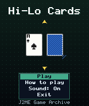
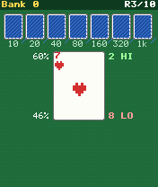
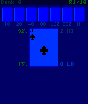

# Hi-Lo Cards

 **Card** &middot; Game 036 of 100 &middot; v1.0.0

> Guess higher or lower to climb a seven-card ladder, doubling the prize each rung - bank it or risk it all.

<p>  </p>

<sub>Screenshots at 176x208, captured from the real JAR on the project's reference runtime.</sub>

## About

A push-your-luck card game in ten rounds. Each correct higher-or-lower call doubles the prize, from 10 up to 1000 at the top of the ladder; a single wrong call loses it. Live odds computed from the cards remaining in the deck help you decide when to bank, and one card swap per round can rescue you from a dreaded middle card.

**Objective:** Bank as many points as possible over ten rounds.

## Controls

| Key | Action |
|---|---|
| 2/Up | Guess higher |
| 8/Down | Guess lower |
| 5 | Bank the prize / next round |
| # | Swap the current card (once per round) |
| * | Pause menu |

Every game also supports: `5` to select in menus, `*` to pause, `0` on the title screen to toggle sound, and `#` on the title screen for help. Joystick/D-pad and the 2/4/6/8 keys are interchangeable.

## Download

| File | Link |
|---|---|
| JAR (install this) | [HiLoCards.jar](https://github.com/agneay/j2me-100-games/releases/download/game-036-v1.0.0/HiLoCards.jar) |
| JAD (descriptor for OTA install) | [HiLoCards.jad](https://github.com/agneay/j2me-100-games/releases/download/game-036-v1.0.0/HiLoCards.jad) |
| Release page | [game-036-v1.0.0](https://github.com/agneay/j2me-100-games/releases/tag/game-036-v1.0.0) |
| All 100 games | [j2me-100-games-v1.0.0.zip](https://github.com/agneay/j2me-100-games/releases/download/v1.0.0/j2me-100-games-v1.0.0.zip) |

**Browser Demo:** [play in your browser](https://agneay.github.io/j2me-100-games/games/hi-lo-cards/). The browser demo is the same Java source compiled to JavaScript with TeaVM and run on the project's MIDP reference runtime; it is a convenience preview, not the original Java ME version. For the authentic experience install the JAR on a phone or in an emulator.

Installation help: [docs/installing.md](../../docs/installing.md) and [docs/emulator.md](../../docs/emulator.md).

## Technical details

| | |
|---|---|
| MIDlet class | `hilocards.HiLoCardsMIDlet` |
| Platform | Java ME, CLDC 1.0, MIDP 2.0 |
| JAR size | 19.3 KB |
| Designed for | 128x128, 128x160, 176x208, 176x220, 240x320 |
| Storage | RMS record store `gk` (settings and best score) |
| Floating point | none (integer maths only) |

## Verification

| Level | Status |
|---|---|
| Build verified | Yes: compiled against the CLDC 1.0 / MIDP 2.0 API, JAR + JAD generated |
| Reference runtime | Passed at 128x128, 128x160, 176x208, 176x220, 240x320 (automated, project's headless MIDP runtime) |
| Emulator verified | Yes: automated smoke test on MicroEmulator 2.0.4 (176x220) |
| Real device verified | Not yet tested on real hardware |

Tested it on a real phone? Please [report it](https://github.com/agneay/j2me-100-games/issues/new?template=device-report.yml) so this table can be updated honestly.

## Build from source

```bash
python tools/bootstrap.py
tools/build-game.sh 036
```

Output: `games/036-hi-lo-cards/dist/HiLoCards.jar` and `.jad`. See [docs/building.md](../../docs/building.md).

---

Part of [J2ME 100 Games](../../README.md). Original game, released under the [MIT License](../../LICENSE).
