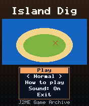
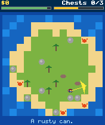
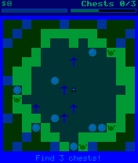

# Island Dig

 **RPG** &middot; Game 037 of 100 &middot; v1.0.0

> Comb a random island with a metal detector and three compass readings to dig up three buried chests.

<p>  </p>

<sub>Screenshots at 176x208, captured from the real JAR on the project's reference runtime.</sub>

## About

A turn-based treasure hunt on a freshly generated island. Each step drains energy and updates your metal detector, which beeps louder as you close in on an unfound chest. Three compass readings point the way when you are lost. Digging turns up coins, coconuts and junk as well as treasure, while wandering crabs pinch anyone who gets in their way.

**Objective:** Dig up all three treasure chests before your energy runs out.

**Modes:** Normal, Hard (less energy)

## Controls

| Key | Action |
|---|---|
| 2/4/6/8 | Walk |
| 5 | Dig |
| # | Use compass (3 per game) |
| * | Pause menu |

Every game also supports: `5` to select in menus, `*` to pause, `0` on the title screen to toggle sound, and `#` on the title screen for help. Joystick/D-pad and the 2/4/6/8 keys are interchangeable.

## Download

| File | Link |
|---|---|
| JAR (install this) | [IslandDig.jar](https://github.com/agneay/j2me-100-games/releases/download/game-037-v1.0.0/IslandDig.jar) |
| JAD (descriptor for OTA install) | [IslandDig.jad](https://github.com/agneay/j2me-100-games/releases/download/game-037-v1.0.0/IslandDig.jad) |
| Release page | [game-037-v1.0.0](https://github.com/agneay/j2me-100-games/releases/tag/game-037-v1.0.0) |
| All 100 games | [j2me-100-games-v1.0.0.zip](https://github.com/agneay/j2me-100-games/releases/download/v1.0.0/j2me-100-games-v1.0.0.zip) |

**Browser Demo:** [play in your browser](https://agneay.github.io/j2me-100-games/games/island-dig/). The browser demo is the same Java source compiled to JavaScript with TeaVM and run on the project's MIDP reference runtime; it is a convenience preview, not the original Java ME version. For the authentic experience install the JAR on a phone or in an emulator.

Installation help: [docs/installing.md](../../docs/installing.md) and [docs/emulator.md](../../docs/emulator.md).

## Technical details

| | |
|---|---|
| MIDlet class | `islanddig.IslandDigMIDlet` |
| Platform | Java ME, CLDC 1.0, MIDP 2.0 |
| JAR size | 18.8 KB |
| Designed for | 128x128, 128x160, 176x208, 176x220, 240x320 |
| Storage | RMS record store `gk` (settings and best score) |
| Floating point | none (integer maths only) |

## Verification

| Level | Status |
|---|---|
| Build verified | Yes: compiled against the CLDC 1.0 / MIDP 2.0 API, JAR + JAD generated |
| Reference runtime | Passed at 128x128, 128x160, 176x208, 176x220, 240x320 (automated, project's headless MIDP runtime) |
| Emulator verified | Yes: automated smoke test on MicroEmulator 2.0.4 (176x220) |
| Real device verified | Not yet tested on real hardware |

Tested it on a real phone? Please [report it](https://github.com/agneay/j2me-100-games/issues/new?template=device-report.yml) so this table can be updated honestly.

## Build from source

```bash
python tools/bootstrap.py
tools/build-game.sh 037
```

Output: `games/037-island-dig/dist/IslandDig.jar` and `.jad`. See [docs/building.md](../../docs/building.md).

---

Part of [J2ME 100 Games](../../README.md). Original game, released under the [MIT License](../../LICENSE).
