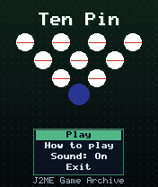
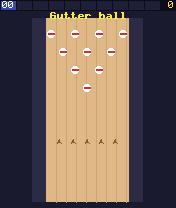
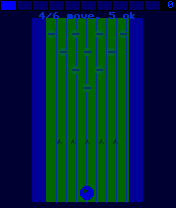

# Ten Pin

 **Sports** &middot; Game 038 of 100 &middot; v1.0.0

> Ten frames of bowling with pin-to-pin collisions and proper strike and spare scoring.

<p>  </p>

<sub>Screenshots at 176x208, captured from the real JAR on the project's reference runtime.</sub>

## About

Choose your release point, stop the swinging aim arrow and time the power meter, then watch the ball crash into the rack. Pins are simulated as circles that pass momentum to each other, so a ball into the pocket really does scatter the deck. Full ten-frame scoring with strike and spare bonuses and a three-ball tenth frame; a perfect game is 300.

**Objective:** Score as many points as possible over ten frames (maximum 300).

## Controls

| Key | Action |
|---|---|
| 4/6 | Choose release position |
| 5 | Confirm position / aim / power |
| * | Pause menu |

Every game also supports: `5` to select in menus, `*` to pause, `0` on the title screen to toggle sound, and `#` on the title screen for help. Joystick/D-pad and the 2/4/6/8 keys are interchangeable.

## Download

| File | Link |
|---|---|
| JAR (install this) | [TenPin.jar](https://github.com/agneay/j2me-100-games/releases/download/game-038-v1.0.0/TenPin.jar) |
| JAD (descriptor for OTA install) | [TenPin.jad](https://github.com/agneay/j2me-100-games/releases/download/game-038-v1.0.0/TenPin.jad) |
| Release page | [game-038-v1.0.0](https://github.com/agneay/j2me-100-games/releases/tag/game-038-v1.0.0) |
| All 100 games | [j2me-100-games-v1.0.0.zip](https://github.com/agneay/j2me-100-games/releases/download/v1.0.0/j2me-100-games-v1.0.0.zip) |

**Browser Demo:** [play in your browser](https://agneay.github.io/j2me-100-games/games/ten-pin/). The browser demo is the same Java source compiled to JavaScript with TeaVM and run on the project's MIDP reference runtime; it is a convenience preview, not the original Java ME version. For the authentic experience install the JAR on a phone or in an emulator.

Installation help: [docs/installing.md](../../docs/installing.md) and [docs/emulator.md](../../docs/emulator.md).

## Technical details

| | |
|---|---|
| MIDlet class | `tenpin.TenPinMIDlet` |
| Platform | Java ME, CLDC 1.0, MIDP 2.0 |
| JAR size | 19.2 KB |
| Designed for | 128x128, 128x160, 176x208, 176x220, 240x320 |
| Storage | RMS record store `gk` (settings and best score) |
| Floating point | none (integer maths only) |

## Verification

| Level | Status |
|---|---|
| Build verified | Yes: compiled against the CLDC 1.0 / MIDP 2.0 API, JAR + JAD generated |
| Reference runtime | Passed at 128x128, 128x160, 176x208, 176x220, 240x320 (automated, project's headless MIDP runtime) |
| Emulator verified | Yes: automated smoke test on MicroEmulator 2.0.4 (176x220) |
| Real device verified | Not yet tested on real hardware |

Tested it on a real phone? Please [report it](https://github.com/agneay/j2me-100-games/issues/new?template=device-report.yml) so this table can be updated honestly.

## Build from source

```bash
python tools/bootstrap.py
tools/build-game.sh 038
```

Output: `games/038-ten-pin/dist/TenPin.jar` and `.jad`. See [docs/building.md](../../docs/building.md).

---

Part of [J2ME 100 Games](../../README.md). Original game, released under the [MIT License](../../LICENSE).
