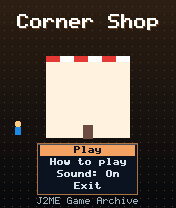
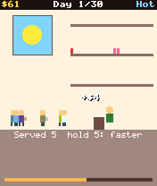
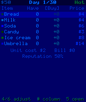

# Corner Shop

 **Simulation** &middot; Game 039 of 100 &middot; v1.0.0

> Stock the shelves, set your prices and read the weather to turn $50 into a fortune in 30 days.

<p>  </p>

<sub>Screenshots at 176x208, captured from the real JAR on the project's reference runtime.</sub>

## About

A pocket shop-keeping sim. Each morning check the forecast, buy six kinds of stock at wholesale and set selling prices; then open the doors and watch customers walk in. Hot days sell ice cream, rain sells umbrellas, overpricing drives people away, empty shelves cost reputation, and bread, milk and ice cream spoil if left on the shelf. A daily report shows sales, costs and spoilage.

**Objective:** Finish 30 days with as much cash as possible ($200 counts as a win, $500 is excellent).

## Controls

| Key | Action |
|---|---|
| 2/8 | Choose item |
| 4/6 | Change buy quantity or price |
| # | Switch buy / price column |
| 5 | Open the shop / continue |
| 5 (hold) | Fast-forward the day |
| * | Pause menu |

Every game also supports: `5` to select in menus, `*` to pause, `0` on the title screen to toggle sound, and `#` on the title screen for help. Joystick/D-pad and the 2/4/6/8 keys are interchangeable.

## Download

| File | Link |
|---|---|
| JAR (install this) | [CornerShop.jar](https://github.com/agneay/j2me-100-games/releases/download/game-039-v1.0.0/CornerShop.jar) |
| JAD (descriptor for OTA install) | [CornerShop.jad](https://github.com/agneay/j2me-100-games/releases/download/game-039-v1.0.0/CornerShop.jad) |
| Release page | [game-039-v1.0.0](https://github.com/agneay/j2me-100-games/releases/tag/game-039-v1.0.0) |
| All 100 games | [j2me-100-games-v1.0.0.zip](https://github.com/agneay/j2me-100-games/releases/download/v1.0.0/j2me-100-games-v1.0.0.zip) |

**Browser Demo:** [play in your browser](https://agneay.github.io/j2me-100-games/games/corner-shop/). The browser demo is the same Java source compiled to JavaScript with TeaVM and run on the project's MIDP reference runtime; it is a convenience preview, not the original Java ME version. For the authentic experience install the JAR on a phone or in an emulator.

Installation help: [docs/installing.md](../../docs/installing.md) and [docs/emulator.md](../../docs/emulator.md).

## Technical details

| | |
|---|---|
| MIDlet class | `cornershop.CornerShopMIDlet` |
| Platform | Java ME, CLDC 1.0, MIDP 2.0 |
| JAR size | 19.5 KB |
| Designed for | 128x128, 128x160, 176x208, 176x220, 240x320 |
| Storage | RMS record store `gk` (settings and best score) |
| Floating point | none (integer maths only) |

## Verification

| Level | Status |
|---|---|
| Build verified | Yes: compiled against the CLDC 1.0 / MIDP 2.0 API, JAR + JAD generated |
| Reference runtime | Passed at 128x128, 128x160, 176x208, 176x220, 240x320 (automated, project's headless MIDP runtime) |
| Emulator verified | Yes: automated smoke test on MicroEmulator 2.0.4 (176x220) |
| Real device verified | Not yet tested on real hardware |

Tested it on a real phone? Please [report it](https://github.com/agneay/j2me-100-games/issues/new?template=device-report.yml) so this table can be updated honestly.

## Build from source

```bash
python tools/bootstrap.py
tools/build-game.sh 039
```

Output: `games/039-corner-shop/dist/CornerShop.jar` and `.jad`. See [docs/building.md](../../docs/building.md).

---

Part of [J2ME 100 Games](../../README.md). Original game, released under the [MIT License](../../LICENSE).
