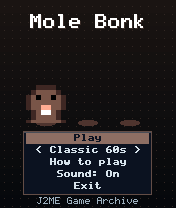
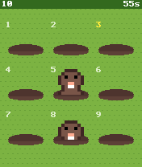
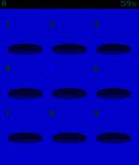

# Mole Bonk

 **Arcade** &middot; Game 040 of 100 &middot; v1.0.0

> Nine molehills laid out like your keypad: press 1-9 to bonk moles, but never the bunnies.

<p>  </p>

<sub>Screenshots at 176x208, captured from the real JAR on the project's reference runtime.</sub>

## About

A reflex game that turns the phone's number pad into the playing field - each hole sits exactly where its key is under your thumb. Moles rise and duck back down faster as time goes on, golden moles pay five times as much, bunnies cost you points and your combo, and a run of hits multiplies your score. Play a 60-second Classic round or Endless, where three escapes end the game.

**Objective:** Score as many points as possible by bonking moles (Classic: in 60 seconds; Endless: until three escape).

**Modes:** Classic 60s, Endless

## Controls

| Key | Action |
|---|---|
| 1-9 | Bonk the matching hole |
| Joystick + select | Move cursor and bonk |
| * | Pause menu |

Every game also supports: `5` to select in menus, `*` to pause, `0` on the title screen to toggle sound, and `#` on the title screen for help. Joystick/D-pad and the 2/4/6/8 keys are interchangeable.

## Download

| File | Link |
|---|---|
| JAR (install this) | [MoleBonk.jar](https://github.com/agneay/j2me-100-games/releases/download/game-040-v1.0.0/MoleBonk.jar) |
| JAD (descriptor for OTA install) | [MoleBonk.jad](https://github.com/agneay/j2me-100-games/releases/download/game-040-v1.0.0/MoleBonk.jad) |
| Release page | [game-040-v1.0.0](https://github.com/agneay/j2me-100-games/releases/tag/game-040-v1.0.0) |
| All 100 games | [j2me-100-games-v1.0.0.zip](https://github.com/agneay/j2me-100-games/releases/download/v1.0.0/j2me-100-games-v1.0.0.zip) |

**Browser Demo:** [play in your browser](https://agneay.github.io/j2me-100-games/games/mole-bonk/). The browser demo is the same Java source compiled to JavaScript with TeaVM and run on the project's MIDP reference runtime; it is a convenience preview, not the original Java ME version. For the authentic experience install the JAR on a phone or in an emulator.

Installation help: [docs/installing.md](../../docs/installing.md) and [docs/emulator.md](../../docs/emulator.md).

## Technical details

| | |
|---|---|
| MIDlet class | `molebonk.MoleBonkMIDlet` |
| Platform | Java ME, CLDC 1.0, MIDP 2.0 |
| JAR size | 17.4 KB |
| Designed for | 128x128, 128x160, 176x208, 176x220, 240x320 |
| Storage | RMS record store `gk` (settings and best score) |
| Floating point | none (integer maths only) |

## Verification

| Level | Status |
|---|---|
| Build verified | Yes: compiled against the CLDC 1.0 / MIDP 2.0 API, JAR + JAD generated |
| Reference runtime | Passed at 128x128, 128x160, 176x208, 176x220, 240x320 (automated, project's headless MIDP runtime) |
| Emulator verified | Yes: automated smoke test on MicroEmulator 2.0.4 (176x220) |
| Real device verified | Not yet tested on real hardware |

Tested it on a real phone? Please [report it](https://github.com/agneay/j2me-100-games/issues/new?template=device-report.yml) so this table can be updated honestly.

## Build from source

```bash
python tools/bootstrap.py
tools/build-game.sh 040
```

Output: `games/040-mole-bonk/dist/MoleBonk.jar` and `.jad`. See [docs/building.md](../../docs/building.md).

---

Part of [J2ME 100 Games](../../README.md). Original game, released under the [MIT License](../../LICENSE).
