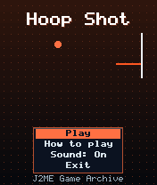
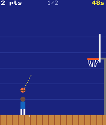
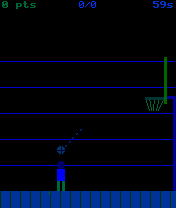

# Hoop Shot

 **Sports** &middot; Game 048 of 100 &middot; v1.0.0

> A 60-second basketball shoot-out: time the aim and power, bank it off the glass, and catch fire.

<p>  </p>

<sub>Screenshots at 176x208, captured from the real JAR on the project's reference runtime.</sub>

## About

Side-on basketball with real projectile physics. Stop the swinging aim arrow, then the power meter, and the ball arcs toward the hoop where it can rattle off the front or back of the rim, kiss the backboard or drop clean through. Shots from beyond the arc are worth three, the shooting spot moves after every basket, and three in a row sets you on fire for double points.

**Objective:** Score as many points as possible in 60 seconds.

## Controls

| Key | Action |
|---|---|
| 5 | Lock aim / lock power |
| * | Pause menu |

Every game also supports: `5` to select in menus, `*` to pause, `0` on the title screen to toggle sound, and `#` on the title screen for help. Joystick/D-pad and the 2/4/6/8 keys are interchangeable.

## Download

| File | Link |
|---|---|
| JAR (install this) | [HoopShot.jar](https://github.com/agneay/j2me-100-games/releases/download/game-048-v1.0.0/HoopShot.jar) |
| JAD (descriptor for OTA install) | [HoopShot.jad](https://github.com/agneay/j2me-100-games/releases/download/game-048-v1.0.0/HoopShot.jad) |
| Release page | [game-048-v1.0.0](https://github.com/agneay/j2me-100-games/releases/tag/game-048-v1.0.0) |
| All 100 games | [j2me-100-games-v1.0.0.zip](https://github.com/agneay/j2me-100-games/releases/download/v1.0.0/j2me-100-games-v1.0.0.zip) |

**Browser Demo:** [play in your browser](https://agneay.github.io/j2me-100-games/games/hoop-shot/). The browser demo is the same Java source compiled to JavaScript with TeaVM and run on the project's MIDP reference runtime; it is a convenience preview, not the original Java ME version. For the authentic experience install the JAR on a phone or in an emulator.

Installation help: [docs/installing.md](../../docs/installing.md) and [docs/emulator.md](../../docs/emulator.md).

## Technical details

| | |
|---|---|
| MIDlet class | `hoopshot.HoopShotMIDlet` |
| Platform | Java ME, CLDC 1.0, MIDP 2.0 |
| JAR size | 17.6 KB |
| Designed for | 128x128, 128x160, 176x208, 176x220, 240x320 |
| Storage | RMS record store `gk` (settings and best score) |
| Floating point | none (integer maths only) |

## Verification

| Level | Status |
|---|---|
| Build verified | Yes: compiled against the CLDC 1.0 / MIDP 2.0 API, JAR + JAD generated |
| Reference runtime | Passed at 128x128, 128x160, 176x208, 176x220, 240x320 (automated, project's headless MIDP runtime) |
| Emulator verified | Yes: automated smoke test on MicroEmulator 2.0.4 (176x220) |
| Real device verified | Not yet tested on real hardware |

Tested it on a real phone? Please [report it](https://github.com/agneay/j2me-100-games/issues/new?template=device-report.yml) so this table can be updated honestly.

## Build from source

```bash
python tools/bootstrap.py
tools/build-game.sh 048
```

Output: `games/048-hoop-shot/dist/HoopShot.jar` and `.jad`. See [docs/building.md](../../docs/building.md).

---

Part of [J2ME 100 Games](../../README.md). Original game, released under the [MIT License](../../LICENSE).
