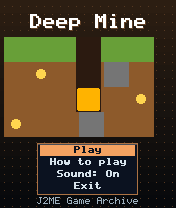
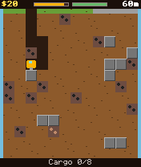
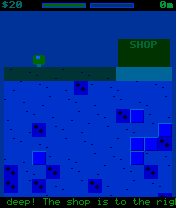

# Deep Mine

 **Simulation** &middot; Game 049 of 100 &middot; v1.0.0

> Drill deep for coal, gold and diamonds, sell your haul at the surface and upgrade your pod to reach the core.

<p>  </p>

<sub>Screenshots at 176x208, captured from the real JAR on the project's reference runtime.</sub>

## About

A mining sim with a little pod and a lot of dirt. Drill sideways and down, fly back up on thrusters, and manage fuel, hull and cargo space as ore gets richer with depth: coal, iron, silver, gold, ruby and diamond. Sell at the surface shop, refuel, repair and upgrade your drill, fuel tank, cargo bay and hull. Undiggable rock, gas pockets, lava and long falls stand between you and the ancient core 600 metres down.

**Objective:** Reach and drill into the ancient core at the bottom of the mine.

## Controls

| Key | Action |
|---|---|
| 4/6 | Drive / drill sideways |
| 8 | Drill down |
| 2 | Fly up |
| 5 | Open shop (at the surface) |
| 0/# | Leave shop |
| * | Pause menu |

Every game also supports: `5` to select in menus, `*` to pause, `0` on the title screen to toggle sound, and `#` on the title screen for help. Joystick/D-pad and the 2/4/6/8 keys are interchangeable.

## Download

| File | Link |
|---|---|
| JAR (install this) | [DeepMine.jar](https://github.com/agneay/j2me-100-games/releases/download/game-049-v1.0.0/DeepMine.jar) |
| JAD (descriptor for OTA install) | [DeepMine.jad](https://github.com/agneay/j2me-100-games/releases/download/game-049-v1.0.0/DeepMine.jad) |
| Release page | [game-049-v1.0.0](https://github.com/agneay/j2me-100-games/releases/tag/game-049-v1.0.0) |
| All 100 games | [j2me-100-games-v1.0.0.zip](https://github.com/agneay/j2me-100-games/releases/download/v1.0.0/j2me-100-games-v1.0.0.zip) |

**Browser Demo:** [play in your browser](https://agneay.github.io/j2me-100-games/games/deep-mine/). The browser demo is the same Java source compiled to JavaScript with TeaVM and run on the project's MIDP reference runtime; it is a convenience preview, not the original Java ME version. For the authentic experience install the JAR on a phone or in an emulator.

Installation help: [docs/installing.md](../../docs/installing.md) and [docs/emulator.md](../../docs/emulator.md).

## Technical details

| | |
|---|---|
| MIDlet class | `deepmine.DeepMineMIDlet` |
| Platform | Java ME, CLDC 1.0, MIDP 2.0 |
| JAR size | 19.5 KB |
| Designed for | 128x128, 128x160, 176x208, 176x220, 240x320 |
| Storage | RMS record store `gk` (settings and best score) |
| Floating point | none (integer maths only) |

## Verification

| Level | Status |
|---|---|
| Build verified | Yes: compiled against the CLDC 1.0 / MIDP 2.0 API, JAR + JAD generated |
| Reference runtime | Passed at 128x128, 128x160, 176x208, 176x220, 240x320 (automated, project's headless MIDP runtime) |
| Emulator verified | Yes: automated smoke test on MicroEmulator 2.0.4 (176x220) |
| Real device verified | Not yet tested on real hardware |

Tested it on a real phone? Please [report it](https://github.com/agneay/j2me-100-games/issues/new?template=device-report.yml) so this table can be updated honestly.

## Build from source

```bash
python tools/bootstrap.py
tools/build-game.sh 049
```

Output: `games/049-deep-mine/dist/DeepMine.jar` and `.jad`. See [docs/building.md](../../docs/building.md).

---

Part of [J2ME 100 Games](../../README.md). Original game, released under the [MIT License](../../LICENSE).
