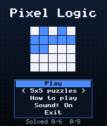
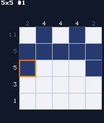
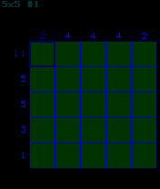

# Pixel Logic

 **Puzzle** &middot; Game 052 of 100 &middot; v1.0.0

> Picture-logic puzzles: use the number clues on every row and column to reveal hidden pixel art.

<p>  </p>

<sub>Screenshots at 176x208, captured from the real JAR on the project's reference runtime.</sub>

## About

Fourteen original picture-logic puzzles - six 5x5 warm-ups and eight 10x10 pictures. Clues list the runs of filled cells in each line; fill cells with 5 and mark known blanks with 0. Clues grey out as their line becomes correct, the cursor's row and column clues are highlighted, and any grid that satisfies every clue counts as solved, so you are never punished for an alternative solution. Progress is saved.

**Objective:** Fill the grid so every row and column matches its clues.

**Modes:** 5x5 puzzles, 10x10 puzzles

## Controls

| Key | Action |
|---|---|
| 2/4/6/8 | Move cursor |
| 5 | Fill / clear cell |
| 0/# | Mark cell as empty |
| * | Pause menu |

Every game also supports: `5` to select in menus, `*` to pause, `0` on the title screen to toggle sound, and `#` on the title screen for help. Joystick/D-pad and the 2/4/6/8 keys are interchangeable.

## Download

| File | Link |
|---|---|
| JAR (install this) | [PixelLogic.jar](https://github.com/agneay/j2me-100-games/releases/download/game-052-v1.0.0/PixelLogic.jar) |
| JAD (descriptor for OTA install) | [PixelLogic.jad](https://github.com/agneay/j2me-100-games/releases/download/game-052-v1.0.0/PixelLogic.jad) |
| Release page | [game-052-v1.0.0](https://github.com/agneay/j2me-100-games/releases/tag/game-052-v1.0.0) |
| All 100 games | [j2me-100-games-v1.0.0.zip](https://github.com/agneay/j2me-100-games/releases/download/v1.0.0/j2me-100-games-v1.0.0.zip) |

**Browser Demo:** [play in your browser](https://agneay.github.io/j2me-100-games/games/pixel-logic/). The browser demo is the same Java source compiled to JavaScript with TeaVM and run on the project's MIDP reference runtime; it is a convenience preview, not the original Java ME version. For the authentic experience install the JAR on a phone or in an emulator.

Installation help: [docs/installing.md](../../docs/installing.md) and [docs/emulator.md](../../docs/emulator.md).

## Technical details

| | |
|---|---|
| MIDlet class | `pixellogic.PixelLogicMIDlet` |
| Platform | Java ME, CLDC 1.0, MIDP 2.0 |
| JAR size | 18.1 KB |
| Designed for | 128x128, 128x160, 176x208, 176x220, 240x320 |
| Storage | RMS record store `gk` (settings and best score) |
| Floating point | none (integer maths only) |

## Verification

| Level | Status |
|---|---|
| Build verified | Yes: compiled against the CLDC 1.0 / MIDP 2.0 API, JAR + JAD generated |
| Reference runtime | Passed at 128x128, 128x160, 176x208, 176x220, 240x320 (automated, project's headless MIDP runtime) |
| Emulator verified | Yes: automated smoke test on MicroEmulator 2.0.4 (176x220) |
| Real device verified | Not yet tested on real hardware |

Tested it on a real phone? Please [report it](https://github.com/agneay/j2me-100-games/issues/new?template=device-report.yml) so this table can be updated honestly.

## Build from source

```bash
python tools/bootstrap.py
tools/build-game.sh 052
```

Output: `games/052-pixel-logic/dist/PixelLogic.jar` and `.jad`. See [docs/building.md](../../docs/building.md).

---

Part of [J2ME 100 Games](../../README.md). Original game, released under the [MIT License](../../LICENSE).
