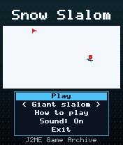
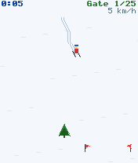
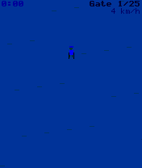

# Snow Slalom

 **Racing** &middot; Game 055 of 100 &middot; v1.0.0

> Carve down the mountain through 25 flag gates against the clock - or freeride through the forest.

<p>  </p>

<sub>Screenshots at 176x208, captured from the real JAR on the project's reference runtime.</sub>

## About

A top-down downhill race. Your skis have five angles: pointing straight down is fastest, while wide carves scrub off speed but get you across the slope. Tuck for extra speed, snowplough to slow down, and thread every red and blue gate; each one you miss costs five seconds, and trees and rocks send you tumbling. Giant slalom has wide gates, Slalom tight ones, and Freeride is an endless forest run.

**Objective:** Pass through every gate and reach the finish line in the fastest time (Freeride: ski as far as you can).

**Modes:** Giant slalom, Slalom, Freeride

## Controls

| Key | Action |
|---|---|
| 4/6 | Turn skis |
| 8 | Tuck (faster) |
| 2 | Snowplough (slower) |
| * | Pause menu |

Every game also supports: `5` to select in menus, `*` to pause, `0` on the title screen to toggle sound, and `#` on the title screen for help. Joystick/D-pad and the 2/4/6/8 keys are interchangeable.

## Download

| File | Link |
|---|---|
| JAR (install this) | [SnowSlalom.jar](https://github.com/agneay/j2me-100-games/releases/download/game-055-v1.0.0/SnowSlalom.jar) |
| JAD (descriptor for OTA install) | [SnowSlalom.jad](https://github.com/agneay/j2me-100-games/releases/download/game-055-v1.0.0/SnowSlalom.jad) |
| Release page | [game-055-v1.0.0](https://github.com/agneay/j2me-100-games/releases/tag/game-055-v1.0.0) |
| All 100 games | [j2me-100-games-v1.0.0.zip](https://github.com/agneay/j2me-100-games/releases/download/v1.0.0/j2me-100-games-v1.0.0.zip) |

**Browser Demo:** [play in your browser](https://agneay.github.io/j2me-100-games/games/snow-slalom/). The browser demo is the same Java source compiled to JavaScript with TeaVM and run on the project's MIDP reference runtime; it is a convenience preview, not the original Java ME version. For the authentic experience install the JAR on a phone or in an emulator.

Installation help: [docs/installing.md](../../docs/installing.md) and [docs/emulator.md](../../docs/emulator.md).

## Technical details

| | |
|---|---|
| MIDlet class | `snowslalom.SnowSlalomMIDlet` |
| Platform | Java ME, CLDC 1.0, MIDP 2.0 |
| JAR size | 17.6 KB |
| Designed for | 128x128, 128x160, 176x208, 176x220, 240x320 |
| Storage | RMS record store `gk` (settings and best score) |
| Floating point | none (integer maths only) |

## Verification

| Level | Status |
|---|---|
| Build verified | Yes: compiled against the CLDC 1.0 / MIDP 2.0 API, JAR + JAD generated |
| Reference runtime | Passed at 128x128, 128x160, 176x208, 176x220, 240x320 (automated, project's headless MIDP runtime) |
| Emulator verified | Yes: automated smoke test on MicroEmulator 2.0.4 (176x220) |
| Real device verified | Not yet tested on real hardware |

Tested it on a real phone? Please [report it](https://github.com/agneay/j2me-100-games/issues/new?template=device-report.yml) so this table can be updated honestly.

## Build from source

```bash
python tools/bootstrap.py
tools/build-game.sh 055
```

Output: `games/055-snow-slalom/dist/SnowSlalom.jar` and `.jad`. See [docs/building.md](../../docs/building.md).

---

Part of [J2ME 100 Games](../../README.md). Original game, released under the [MIT License](../../LICENSE).
