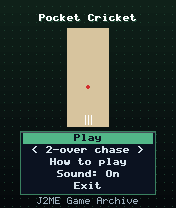
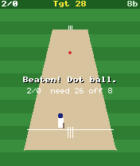
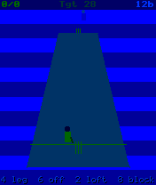

# Pocket Cricket

 **Sports** &middot; Game 059 of 100 &middot; v1.0.0

> Chase down a target in a two-over, super-over or five-over run chase - pick the shot and nail the timing.

<p>  </p>

<sub>Screenshots at 176x208, captured from the real JAR on the project's reference runtime.</sub>

## About

A batting game built around reading the delivery. Each ball has a line (leg, middle, off), a length (yorker, full, good, short) and a pace; play to the leg side with 4, the off side with 6, loft it straight with 2 or block with 8, timed to the moment the ball arrives. Perfect timing finds the boundary, short balls sit up to be hit, yorkers are hard to score from, lofted shots risk a catch and leaving a straight ball can cost your stumps.

**Objective:** Score the target runs before you run out of balls or wickets.

**Modes:** 2-over chase, Super over, 5-over chase

## Controls

| Key | Action |
|---|---|
| 4 | Leg-side shot |
| 6 | Off-side shot |
| 2 | Lofted drive |
| 8 | Defensive block |
| 5 | Next ball |
| * | Pause menu |

Every game also supports: `5` to select in menus, `*` to pause, `0` on the title screen to toggle sound, and `#` on the title screen for help. Joystick/D-pad and the 2/4/6/8 keys are interchangeable.

## Download

| File | Link |
|---|---|
| JAR (install this) | [PocketCricket.jar](https://github.com/agneay/j2me-100-games/releases/download/game-059-v1.0.0/PocketCricket.jar) |
| JAD (descriptor for OTA install) | [PocketCricket.jad](https://github.com/agneay/j2me-100-games/releases/download/game-059-v1.0.0/PocketCricket.jad) |
| Release page | [game-059-v1.0.0](https://github.com/agneay/j2me-100-games/releases/tag/game-059-v1.0.0) |
| All 100 games | [j2me-100-games-v1.0.0.zip](https://github.com/agneay/j2me-100-games/releases/download/v1.0.0/j2me-100-games-v1.0.0.zip) |

**Browser Demo:** [play in your browser](https://agneay.github.io/j2me-100-games/games/pocket-cricket/). The browser demo is the same Java source compiled to JavaScript with TeaVM and run on the project's MIDP reference runtime; it is a convenience preview, not the original Java ME version. For the authentic experience install the JAR on a phone or in an emulator.

Installation help: [docs/installing.md](../../docs/installing.md) and [docs/emulator.md](../../docs/emulator.md).

## Technical details

| | |
|---|---|
| MIDlet class | `pocketcricket.PocketCricketMIDlet` |
| Platform | Java ME, CLDC 1.0, MIDP 2.0 |
| JAR size | 18.7 KB |
| Designed for | 128x128, 128x160, 176x208, 176x220, 240x320 |
| Storage | RMS record store `gk` (settings and best score) |
| Floating point | none (integer maths only) |

## Verification

| Level | Status |
|---|---|
| Build verified | Yes: compiled against the CLDC 1.0 / MIDP 2.0 API, JAR + JAD generated |
| Reference runtime | Passed at 128x128, 128x160, 176x208, 176x220, 240x320 (automated, project's headless MIDP runtime) |
| Emulator verified | Yes: automated smoke test on MicroEmulator 2.0.4 (176x220) |
| Real device verified | Not yet tested on real hardware |

Tested it on a real phone? Please [report it](https://github.com/agneay/j2me-100-games/issues/new?template=device-report.yml) so this table can be updated honestly.

## Build from source

```bash
python tools/bootstrap.py
tools/build-game.sh 059
```

Output: `games/059-pocket-cricket/dist/PocketCricket.jar` and `.jad`. See [docs/building.md](../../docs/building.md).

---

Part of [J2ME 100 Games](../../README.md). Original game, released under the [MIT License](../../LICENSE).
