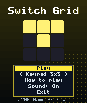
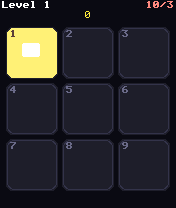
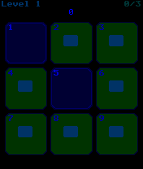

# Switch Grid

 **Puzzle** &middot; Game 062 of 100 &middot; v1.0.0

> Every switch flips its neighbours too - turn all the lights off. On the 3x3 board, the keypad is the grid.

<p>  </p>

<sub>Screenshots at 176x208, captured from the real JAR on the project's reference runtime.</sub>

## About

A light-switching logic puzzle in three flavours. Keypad 3x3 maps keys 1-9 straight onto the switches, Classic 5x5 uses a cursor, and Wrap 5x5 lets neighbours wrap around the edges. Each puzzle is built by pressing random switches, so it is always solvable; finish within par for a bonus. Twenty increasingly scrambled levels.

**Objective:** Turn every light off, ideally within the par number of presses.

**Modes:** Keypad 3x3, Classic 5x5, Wrap 5x5

## Controls

| Key | Action |
|---|---|
| 1-9 | Press that switch (3x3) |
| 2/4/6/8 | Move cursor (5x5) |
| 5 | Press switch (5x5) |
| * | Pause menu |

Every game also supports: `5` to select in menus, `*` to pause, `0` on the title screen to toggle sound, and `#` on the title screen for help. Joystick/D-pad and the 2/4/6/8 keys are interchangeable.

## Download

| File | Link |
|---|---|
| JAR (install this) | [SwitchGrid.jar](https://github.com/agneay/j2me-100-games/releases/download/game-062-v1.0.0/SwitchGrid.jar) |
| JAD (descriptor for OTA install) | [SwitchGrid.jad](https://github.com/agneay/j2me-100-games/releases/download/game-062-v1.0.0/SwitchGrid.jad) |
| Release page | [game-062-v1.0.0](https://github.com/agneay/j2me-100-games/releases/tag/game-062-v1.0.0) |
| All 100 games | [j2me-100-games-v1.0.0.zip](https://github.com/agneay/j2me-100-games/releases/download/v1.0.0/j2me-100-games-v1.0.0.zip) |

**Browser Demo:** [play in your browser](https://agneay.github.io/j2me-100-games/games/switch-grid/). The browser demo is the same Java source compiled to JavaScript with TeaVM and run on the project's MIDP reference runtime; it is a convenience preview, not the original Java ME version. For the authentic experience install the JAR on a phone or in an emulator.

Installation help: [docs/installing.md](../../docs/installing.md) and [docs/emulator.md](../../docs/emulator.md).

## Technical details

| | |
|---|---|
| MIDlet class | `switchgrid.SwitchGridMIDlet` |
| Platform | Java ME, CLDC 1.0, MIDP 2.0 |
| JAR size | 16.8 KB |
| Designed for | 128x128, 128x160, 176x208, 176x220, 240x320 |
| Storage | RMS record store `gk` (settings and best score) |
| Floating point | none (integer maths only) |

## Verification

| Level | Status |
|---|---|
| Build verified | Yes: compiled against the CLDC 1.0 / MIDP 2.0 API, JAR + JAD generated |
| Reference runtime | Passed at 128x128, 128x160, 176x208, 176x220, 240x320 (automated, project's headless MIDP runtime) |
| Emulator verified | Yes: automated smoke test on MicroEmulator 2.0.4 (176x220) |
| Real device verified | Not yet tested on real hardware |

Tested it on a real phone? Please [report it](https://github.com/agneay/j2me-100-games/issues/new?template=device-report.yml) so this table can be updated honestly.

## Build from source

```bash
python tools/bootstrap.py
tools/build-game.sh 062
```

Output: `games/062-switch-grid/dist/SwitchGrid.jar` and `.jad`. See [docs/building.md](../../docs/building.md).

---

Part of [J2ME 100 Games](../../README.md). Original game, released under the [MIT License](../../LICENSE).
