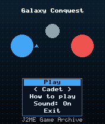
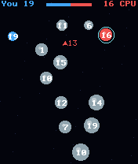
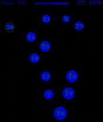

# Galaxy Conquest

 **Strategy** &middot; Game 066 of 100 &middot; v1.0.0

> Real-time space strategy: send fleets between planets to out-produce and overwhelm the red empire.

<p>  </p>

<sub>Screenshots at 176x208, captured from the real JAR on the project's reference runtime.</sub>

## About

Planets of different sizes build ships at different rates. Jump the cursor between planets with the direction keys, pick a planet you own and a target, and half its ships launch. Fleets that land on enemy or neutral worlds battle the defenders and capture the planet if they outnumber them. The CPU picks targets by value and distance, and on Admiral it also reinforces its weak worlds. Every map is freshly generated.

**Objective:** Capture every red planet and destroy every red fleet.

**Modes:** Cadet, Admiral

## Controls

| Key | Action |
|---|---|
| 2/4/6/8 | Jump to the nearest planet in that direction |
| 5 | Choose source planet, then target |
| 0 | Cancel |
| * | Pause menu |

Every game also supports: `5` to select in menus, `*` to pause, `0` on the title screen to toggle sound, and `#` on the title screen for help. Joystick/D-pad and the 2/4/6/8 keys are interchangeable.

## Download

| File | Link |
|---|---|
| JAR (install this) | [GalaxyConquest.jar](https://github.com/agneay/j2me-100-games/releases/download/game-066-v1.0.0/GalaxyConquest.jar) |
| JAD (descriptor for OTA install) | [GalaxyConquest.jad](https://github.com/agneay/j2me-100-games/releases/download/game-066-v1.0.0/GalaxyConquest.jad) |
| Release page | [game-066-v1.0.0](https://github.com/agneay/j2me-100-games/releases/tag/game-066-v1.0.0) |
| All 100 games | [j2me-100-games-v1.0.0.zip](https://github.com/agneay/j2me-100-games/releases/download/v1.0.0/j2me-100-games-v1.0.0.zip) |

**Browser Demo:** [play in your browser](https://agneay.github.io/j2me-100-games/games/galaxy-conquest/). The browser demo is the same Java source compiled to JavaScript with TeaVM and run on the project's MIDP reference runtime; it is a convenience preview, not the original Java ME version. For the authentic experience install the JAR on a phone or in an emulator.

Installation help: [docs/installing.md](../../docs/installing.md) and [docs/emulator.md](../../docs/emulator.md).

## Technical details

| | |
|---|---|
| MIDlet class | `galaxyconquest.GalaxyConquestMIDlet` |
| Platform | Java ME, CLDC 1.0, MIDP 2.0 |
| JAR size | 18.0 KB |
| Designed for | 128x128, 128x160, 176x208, 176x220, 240x320 |
| Storage | RMS record store `gk` (settings and best score) |
| Floating point | none (integer maths only) |

## Verification

| Level | Status |
|---|---|
| Build verified | Yes: compiled against the CLDC 1.0 / MIDP 2.0 API, JAR + JAD generated |
| Reference runtime | Passed at 128x128, 128x160, 176x208, 176x220, 240x320 (automated, project's headless MIDP runtime) |
| Emulator verified | Yes: automated smoke test on MicroEmulator 2.0.4 (176x220) |
| Real device verified | Not yet tested on real hardware |

Tested it on a real phone? Please [report it](https://github.com/agneay/j2me-100-games/issues/new?template=device-report.yml) so this table can be updated honestly.

## Build from source

```bash
python tools/bootstrap.py
tools/build-game.sh 066
```

Output: `games/066-galaxy-conquest/dist/GalaxyConquest.jar` and `.jad`. See [docs/building.md](../../docs/building.md).

---

Part of [J2ME 100 Games](../../README.md). Original game, released under the [MIT License](../../LICENSE).
