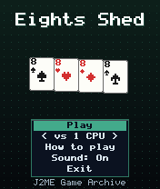
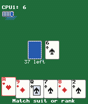
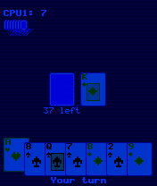

# Eights Shed

 **Card** &middot; Game 067 of 100 &middot; v1.0.0

> Shed your hand by matching suit or rank - eights are wild - against one to three CPU players.

<p>  </p>

<sub>Screenshots at 176x208, captured from the real JAR on the project's reference runtime.</sub>

## About

The classic shedding card game. Match the top card's suit or rank, play an eight at any time to name a new suit, and draw when you're stuck. CPU opponents keep the suits they hold most, save their eights for emergencies and warn you when they're down to their last card. Winning scores the points left in the other players' hands (eights are worth 50).

**Objective:** Be the first player to play every card in your hand.

**Modes:** vs 1 CPU, vs 2 CPUs, vs 3 CPUs

## Controls

| Key | Action |
|---|---|
| 4/6 | Choose card |
| 5 | Play card / confirm suit |
| # | Draw a card / pass |
| * | Pause menu |

Every game also supports: `5` to select in menus, `*` to pause, `0` on the title screen to toggle sound, and `#` on the title screen for help. Joystick/D-pad and the 2/4/6/8 keys are interchangeable.

## Download

| File | Link |
|---|---|
| JAR (install this) | [EightsShed.jar](https://github.com/agneay/j2me-100-games/releases/download/game-067-v1.0.0/EightsShed.jar) |
| JAD (descriptor for OTA install) | [EightsShed.jad](https://github.com/agneay/j2me-100-games/releases/download/game-067-v1.0.0/EightsShed.jad) |
| Release page | [game-067-v1.0.0](https://github.com/agneay/j2me-100-games/releases/tag/game-067-v1.0.0) |
| All 100 games | [j2me-100-games-v1.0.0.zip](https://github.com/agneay/j2me-100-games/releases/download/v1.0.0/j2me-100-games-v1.0.0.zip) |

**Browser Demo:** [play in your browser](https://agneay.github.io/j2me-100-games/games/eights-shed/). The browser demo is the same Java source compiled to JavaScript with TeaVM and run on the project's MIDP reference runtime; it is a convenience preview, not the original Java ME version. For the authentic experience install the JAR on a phone or in an emulator.

Installation help: [docs/installing.md](../../docs/installing.md) and [docs/emulator.md](../../docs/emulator.md).

## Technical details

| | |
|---|---|
| MIDlet class | `eightsshed.EightsShedMIDlet` |
| Platform | Java ME, CLDC 1.0, MIDP 2.0 |
| JAR size | 19.9 KB |
| Designed for | 128x128, 128x160, 176x208, 176x220, 240x320 |
| Storage | RMS record store `gk` (settings and best score) |
| Floating point | none (integer maths only) |

## Verification

| Level | Status |
|---|---|
| Build verified | Yes: compiled against the CLDC 1.0 / MIDP 2.0 API, JAR + JAD generated |
| Reference runtime | Passed at 128x128, 128x160, 176x208, 176x220, 240x320 (automated, project's headless MIDP runtime) |
| Emulator verified | Yes: automated smoke test on MicroEmulator 2.0.4 (176x220) |
| Real device verified | Not yet tested on real hardware |

Tested it on a real phone? Please [report it](https://github.com/agneay/j2me-100-games/issues/new?template=device-report.yml) so this table can be updated honestly.

## Build from source

```bash
python tools/bootstrap.py
tools/build-game.sh 067
```

Output: `games/067-eights-shed/dist/EightsShed.jar` and `.jad`. See [docs/building.md](../../docs/building.md).

---

Part of [J2ME 100 Games](../../README.md). Original game, released under the [MIT License](../../LICENSE).
