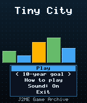
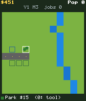
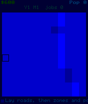

# Tiny City

 **Simulation** &middot; Game 070 of 100 &middot; v1.0.0

> Zone homes, shops and factories, lay roads and power, and grow a town of 2000 citizens in ten years.

<p>  </p>

<sub>Screenshots at 176x208, captured from the real JAR on the project's reference runtime.</sub>

## About

A pocket city builder on a 12x12 map with a winding river. Zones grow on their own when they touch a road and sit within reach of a power plant; residents need jobs, jobs need residents, parks help neighbourhoods and factories next to homes hold them back. Monthly taxes pay for road and power upkeep, bridges cost extra, and the goal is 2000 citizens within ten years. Sandbox mode has unlimited money.

**Objective:** Reach a population of 2000 within ten years without going bankrupt.

**Modes:** 10-year goal, Sandbox

## Controls

| Key | Action |
|---|---|
| 2/4/6/8 | Move cursor |
| 5 | Build with the current tool |
| 0/# | Next tool |
| 1 | Previous tool |
| * | Pause menu |

Every game also supports: `5` to select in menus, `*` to pause, `0` on the title screen to toggle sound, and `#` on the title screen for help. Joystick/D-pad and the 2/4/6/8 keys are interchangeable.

## Download

| File | Link |
|---|---|
| JAR (install this) | [TinyCity.jar](https://github.com/agneay/j2me-100-games/releases/download/game-070-v1.0.0/TinyCity.jar) |
| JAD (descriptor for OTA install) | [TinyCity.jad](https://github.com/agneay/j2me-100-games/releases/download/game-070-v1.0.0/TinyCity.jad) |
| Release page | [game-070-v1.0.0](https://github.com/agneay/j2me-100-games/releases/tag/game-070-v1.0.0) |
| All 100 games | [j2me-100-games-v1.0.0.zip](https://github.com/agneay/j2me-100-games/releases/download/v1.0.0/j2me-100-games-v1.0.0.zip) |

**Browser Demo:** [play in your browser](https://agneay.github.io/j2me-100-games/games/tiny-city/). The browser demo is the same Java source compiled to JavaScript with TeaVM and run on the project's MIDP reference runtime; it is a convenience preview, not the original Java ME version. For the authentic experience install the JAR on a phone or in an emulator.

Installation help: [docs/installing.md](../../docs/installing.md) and [docs/emulator.md](../../docs/emulator.md).

## Technical details

| | |
|---|---|
| MIDlet class | `tinycity.TinyCityMIDlet` |
| Platform | Java ME, CLDC 1.0, MIDP 2.0 |
| JAR size | 18.3 KB |
| Designed for | 128x128, 128x160, 176x208, 176x220, 240x320 |
| Storage | RMS record store `gk` (settings and best score) |
| Floating point | none (integer maths only) |

## Verification

| Level | Status |
|---|---|
| Build verified | Yes: compiled against the CLDC 1.0 / MIDP 2.0 API, JAR + JAD generated |
| Reference runtime | Passed at 128x128, 128x160, 176x208, 176x220, 240x320 (automated, project's headless MIDP runtime) |
| Emulator verified | Yes: automated smoke test on MicroEmulator 2.0.4 (176x220) |
| Real device verified | Not yet tested on real hardware |

Tested it on a real phone? Please [report it](https://github.com/agneay/j2me-100-games/issues/new?template=device-report.yml) so this table can be updated honestly.

## Build from source

```bash
python tools/bootstrap.py
tools/build-game.sh 070
```

Output: `games/070-tiny-city/dist/TinyCity.jar` and `.jad`. See [docs/building.md](../../docs/building.md).

---

Part of [J2ME 100 Games](../../README.md). Original game, released under the [MIT License](../../LICENSE).
