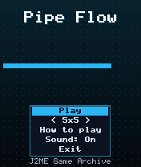
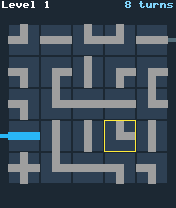
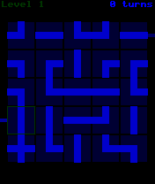

# Pipe Flow

 **Puzzle** &middot; Game 072 of 100 &middot; v1.0.0

> Rotate pipe tiles to connect the water inlet to the drain - every grid is generated around a guaranteed solution.

<p>  </p>

<sub>Screenshots at 176x208, captured from the real JAR on the project's reference runtime.</sub>

## About

A plumbing puzzle where each tile is a straight, bend, junction or cross. The generator lays a random self-avoiding route from inlet to drain, fills the rest with decoy pipes and spins every tile, so each board is solvable but never the same. Water spreads live through connected pipes as you rotate, so you can see your progress. Fifteen levels on a 5x5 or 7x7 grid; fewer turns score more.

**Objective:** Connect the inlet on the left to the drain on the right on every level.

**Modes:** 5x5, 7x7

## Controls

| Key | Action |
|---|---|
| 2/4/6/8 | Move cursor |
| 5 | Rotate clockwise |
| 0 | Rotate anticlockwise |
| * | Pause menu |

Every game also supports: `5` to select in menus, `*` to pause, `0` on the title screen to toggle sound, and `#` on the title screen for help. Joystick/D-pad and the 2/4/6/8 keys are interchangeable.

## Download

| File | Link |
|---|---|
| JAR (install this) | [PipeFlow.jar](https://github.com/agneay/j2me-100-games/releases/download/game-072-v1.0.0/PipeFlow.jar) |
| JAD (descriptor for OTA install) | [PipeFlow.jad](https://github.com/agneay/j2me-100-games/releases/download/game-072-v1.0.0/PipeFlow.jad) |
| Release page | [game-072-v1.0.0](https://github.com/agneay/j2me-100-games/releases/tag/game-072-v1.0.0) |
| All 100 games | [j2me-100-games-v1.0.0.zip](https://github.com/agneay/j2me-100-games/releases/download/v1.0.0/j2me-100-games-v1.0.0.zip) |

**Browser Demo:** [play in your browser](https://agneay.github.io/j2me-100-games/games/pipe-flow/). The browser demo is the same Java source compiled to JavaScript with TeaVM and run on the project's MIDP reference runtime; it is a convenience preview, not the original Java ME version. For the authentic experience install the JAR on a phone or in an emulator.

Installation help: [docs/installing.md](../../docs/installing.md) and [docs/emulator.md](../../docs/emulator.md).

## Technical details

| | |
|---|---|
| MIDlet class | `pipeflow.PipeFlowMIDlet` |
| Platform | Java ME, CLDC 1.0, MIDP 2.0 |
| JAR size | 17.1 KB |
| Designed for | 128x128, 128x160, 176x208, 176x220, 240x320 |
| Storage | RMS record store `gk` (settings and best score) |
| Floating point | none (integer maths only) |

## Verification

| Level | Status |
|---|---|
| Build verified | Yes: compiled against the CLDC 1.0 / MIDP 2.0 API, JAR + JAD generated |
| Reference runtime | Passed at 128x128, 128x160, 176x208, 176x220, 240x320 (automated, project's headless MIDP runtime) |
| Emulator verified | Yes: automated smoke test on MicroEmulator 2.0.4 (176x220) |
| Real device verified | Not yet tested on real hardware |

Tested it on a real phone? Please [report it](https://github.com/agneay/j2me-100-games/issues/new?template=device-report.yml) so this table can be updated honestly.

## Build from source

```bash
python tools/bootstrap.py
tools/build-game.sh 072
```

Output: `games/072-pipe-flow/dist/PipeFlow.jar` and `.jad`. See [docs/building.md](../../docs/building.md).

---

Part of [J2ME 100 Games](../../README.md). Original game, released under the [MIT License](../../LICENSE).
