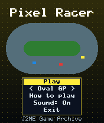
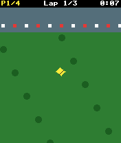
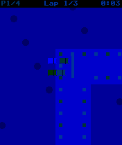

# Pixel Racer

 **Racing** &middot; Game 075 of 100 &middot; v1.0.0

> Top-down three-lap circuit races against three AI drivers on two Grand Prix tracks.

<p>  </p>

<sub>Screenshots at 176x208, captured from the real JAR on the project's reference runtime.</sub>

## About

Wheel-to-wheel racing from above. Start from a grid, slipstream your way through the pack, brake for the tight corners and keep off the grass. AI rivals follow the racing line and ease off for bends, cars bump and slow each other in close combat, and the HUD shows your live position. Oval GP is fast and flowing; Twisty GP tests your braking.

**Objective:** Finish the three-lap race in first place.

**Modes:** Oval GP, Twisty GP

## Controls

| Key | Action |
|---|---|
| 2/5 | Accelerate |
| 8 | Brake |
| 4/6 | Steer |
| * | Pause menu |

Every game also supports: `5` to select in menus, `*` to pause, `0` on the title screen to toggle sound, and `#` on the title screen for help. Joystick/D-pad and the 2/4/6/8 keys are interchangeable.

## Download

| File | Link |
|---|---|
| JAR (install this) | [PixelRacer.jar](https://github.com/agneay/j2me-100-games/releases/download/game-075-v1.0.0/PixelRacer.jar) |
| JAD (descriptor for OTA install) | [PixelRacer.jad](https://github.com/agneay/j2me-100-games/releases/download/game-075-v1.0.0/PixelRacer.jad) |
| Release page | [game-075-v1.0.0](https://github.com/agneay/j2me-100-games/releases/tag/game-075-v1.0.0) |
| All 100 games | [j2me-100-games-v1.0.0.zip](https://github.com/agneay/j2me-100-games/releases/download/v1.0.0/j2me-100-games-v1.0.0.zip) |

**Browser Demo:** [play in your browser](https://agneay.github.io/j2me-100-games/games/pixel-racer/). The browser demo is the same Java source compiled to JavaScript with TeaVM and run on the project's MIDP reference runtime; it is a convenience preview, not the original Java ME version. For the authentic experience install the JAR on a phone or in an emulator.

Installation help: [docs/installing.md](../../docs/installing.md) and [docs/emulator.md](../../docs/emulator.md).

## Technical details

| | |
|---|---|
| MIDlet class | `pixelracer.PixelRacerMIDlet` |
| Platform | Java ME, CLDC 1.0, MIDP 2.0 |
| JAR size | 18.3 KB |
| Designed for | 128x128, 128x160, 176x208, 176x220, 240x320 |
| Storage | RMS record store `gk` (settings and best score) |
| Floating point | none (integer maths only) |

## Verification

| Level | Status |
|---|---|
| Build verified | Yes: compiled against the CLDC 1.0 / MIDP 2.0 API, JAR + JAD generated |
| Reference runtime | Passed at 128x128, 128x160, 176x208, 176x220, 240x320 (automated, project's headless MIDP runtime) |
| Emulator verified | Yes: automated smoke test on MicroEmulator 2.0.4 (176x220) |
| Real device verified | Not yet tested on real hardware |

Tested it on a real phone? Please [report it](https://github.com/agneay/j2me-100-games/issues/new?template=device-report.yml) so this table can be updated honestly.

## Build from source

```bash
python tools/bootstrap.py
tools/build-game.sh 075
```

Output: `games/075-pixel-racer/dist/PixelRacer.jar` and `.jad`. See [docs/building.md](../../docs/building.md).

---

Part of [J2ME 100 Games](../../README.md). Original game, released under the [MIT License](../../LICENSE).
