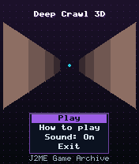
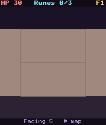
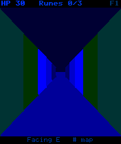

# Deep Crawl 3D

 **RPG** &middot; Game 078 of 100 &middot; v1.0.0

> A first-person step-and-turn dungeon crawler: find three rune stones and the stairs on each of three maze floors.

<p>  </p>

<sub>Screenshots at 176x208, captured from the real JAR on the project's reference runtime.</sub>

## About

Old-school first-person dungeon exploration rendered with nothing but filled triangles: corridors, side openings and dead ends recede into the gloom four squares deep. Each floor is a freshly carved maze with loops. Collect the three glowing rune stones to unlock the stairs, bump-fight the green slimes that block the corridors, and check the auto-map of everywhere you have seen with #.

**Objective:** Collect three runes and take the stairs on each of three floors.

## Controls

| Key | Action |
|---|---|
| 2 | Step forward |
| 8 | Step back |
| 4/6 | Turn left / right |
| 1/3 | Sidestep |
| # | Map |
| * | Pause menu |

Every game also supports: `5` to select in menus, `*` to pause, `0` on the title screen to toggle sound, and `#` on the title screen for help. Joystick/D-pad and the 2/4/6/8 keys are interchangeable.

## Download

| File | Link |
|---|---|
| JAR (install this) | [DeepCrawl3D.jar](https://github.com/agneay/j2me-100-games/releases/download/game-078-v1.0.0/DeepCrawl3D.jar) |
| JAD (descriptor for OTA install) | [DeepCrawl3D.jad](https://github.com/agneay/j2me-100-games/releases/download/game-078-v1.0.0/DeepCrawl3D.jad) |
| Release page | [game-078-v1.0.0](https://github.com/agneay/j2me-100-games/releases/tag/game-078-v1.0.0) |
| All 100 games | [j2me-100-games-v1.0.0.zip](https://github.com/agneay/j2me-100-games/releases/download/v1.0.0/j2me-100-games-v1.0.0.zip) |

**Browser Demo:** [play in your browser](https://agneay.github.io/j2me-100-games/games/deep-crawl-3d/). The browser demo is the same Java source compiled to JavaScript with TeaVM and run on the project's MIDP reference runtime; it is a convenience preview, not the original Java ME version. For the authentic experience install the JAR on a phone or in an emulator.

Installation help: [docs/installing.md](../../docs/installing.md) and [docs/emulator.md](../../docs/emulator.md).

## Technical details

| | |
|---|---|
| MIDlet class | `deepcrawl.DeepCrawl3DMIDlet` |
| Platform | Java ME, CLDC 1.0, MIDP 2.0 |
| JAR size | 18.1 KB |
| Designed for | 128x128, 128x160, 176x208, 176x220, 240x320 |
| Storage | RMS record store `gk` (settings and best score) |
| Floating point | none (integer maths only) |

## Verification

| Level | Status |
|---|---|
| Build verified | Yes: compiled against the CLDC 1.0 / MIDP 2.0 API, JAR + JAD generated |
| Reference runtime | Passed at 128x128, 128x160, 176x208, 176x220, 240x320 (automated, project's headless MIDP runtime) |
| Emulator verified | Yes: automated smoke test on MicroEmulator 2.0.4 (176x220) |
| Real device verified | Not yet tested on real hardware |

Tested it on a real phone? Please [report it](https://github.com/agneay/j2me-100-games/issues/new?template=device-report.yml) so this table can be updated honestly.

## Build from source

```bash
python tools/bootstrap.py
tools/build-game.sh 078
```

Output: `games/078-deep-crawl-3d/dist/DeepCrawl3D.jar` and `.jad`. See [docs/building.md](../../docs/building.md).

---

Part of [J2ME 100 Games](../../README.md). Original game, released under the [MIT License](../../LICENSE).
