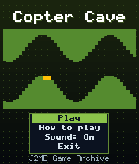
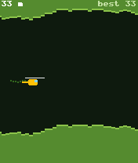
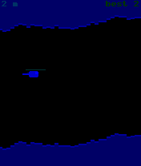

# Copter Cave

 **Arcade** &middot; Game 081 of 100 &middot; v1.0.0

> Hold to climb, release to sink: fly a helicopter through an endless, narrowing cave.

<p>  </p>

<sub>Screenshots at 176x208, captured from the real JAR on the project's reference runtime.</sub>

## About

The purest one-button arcade challenge. Your helicopter climbs while you hold the key and sinks when you let go; the cave meanders, slowly closes in and starts sprouting rock pillars as you fly deeper, while the scroll speed creeps up. Distance is your score and your best flight is saved.

**Objective:** Fly as far as possible without touching the cave or the rock pillars.

## Controls

| Key | Action |
|---|---|
| 5/2 (hold) | Climb |
| * | Pause menu |

Every game also supports: `5` to select in menus, `*` to pause, `0` on the title screen to toggle sound, and `#` on the title screen for help. Joystick/D-pad and the 2/4/6/8 keys are interchangeable.

## Download

| File | Link |
|---|---|
| JAR (install this) | [CopterCave.jar](https://github.com/agneay/j2me-100-games/releases/download/game-081-v1.0.0/CopterCave.jar) |
| JAD (descriptor for OTA install) | [CopterCave.jad](https://github.com/agneay/j2me-100-games/releases/download/game-081-v1.0.0/CopterCave.jad) |
| Release page | [game-081-v1.0.0](https://github.com/agneay/j2me-100-games/releases/tag/game-081-v1.0.0) |
| All 100 games | [j2me-100-games-v1.0.0.zip](https://github.com/agneay/j2me-100-games/releases/download/v1.0.0/j2me-100-games-v1.0.0.zip) |

**Browser Demo:** [play in your browser](https://agneay.github.io/j2me-100-games/games/copter-cave/). The browser demo is the same Java source compiled to JavaScript with TeaVM and run on the project's MIDP reference runtime; it is a convenience preview, not the original Java ME version. For the authentic experience install the JAR on a phone or in an emulator.

Installation help: [docs/installing.md](../../docs/installing.md) and [docs/emulator.md](../../docs/emulator.md).

## Technical details

| | |
|---|---|
| MIDlet class | `coptercave.CopterCaveMIDlet` |
| Platform | Java ME, CLDC 1.0, MIDP 2.0 |
| JAR size | 16.4 KB |
| Designed for | 128x128, 128x160, 176x208, 176x220, 240x320 |
| Storage | RMS record store `gk` (settings and best score) |
| Floating point | none (integer maths only) |

## Verification

| Level | Status |
|---|---|
| Build verified | Yes: compiled against the CLDC 1.0 / MIDP 2.0 API, JAR + JAD generated |
| Reference runtime | Passed at 128x128, 128x160, 176x208, 176x220, 240x320 (automated, project's headless MIDP runtime) |
| Emulator verified | Yes: automated smoke test on MicroEmulator 2.0.4 (176x220) |
| Real device verified | Not yet tested on real hardware |

Tested it on a real phone? Please [report it](https://github.com/agneay/j2me-100-games/issues/new?template=device-report.yml) so this table can be updated honestly.

## Build from source

```bash
python tools/bootstrap.py
tools/build-game.sh 081
```

Output: `games/081-copter-cave/dist/CopterCave.jar` and `.jad`. See [docs/building.md](../../docs/building.md).

---

Part of [J2ME 100 Games](../../README.md). Original game, released under the [MIT License](../../LICENSE).
