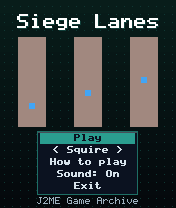
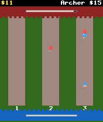
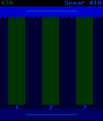

# Siege Lanes

 **Strategy** &middot; Game 086 of 100 &middot; v1.0.0

> Three lanes, two castles: spend gold to send spearmen, archers and knights up a lane with keys 1-3.

<p>  </p>

<sub>Screenshots at 176x208, captured from the real JAR on the project's reference runtime.</sub>

## About

A real-time lane battle for the keypad. Gold trickles in; pick a troop type and press 1, 2 or 3 to deploy it into the left, middle or right lane. Spearmen are cheap, archers strike from range and knights soak up damage. Troops fight anything they meet and batter the enemy castle if they break through, while the CPU reinforces whichever lane you are pushing hardest.

**Objective:** Destroy the enemy castle before your own falls.

**Modes:** Squire, Warlord

## Controls

| Key | Action |
|---|---|
| 4/6 | Choose troop type |
| 1/2/3 | Deploy to left / middle / right lane |
| * | Pause menu |

Every game also supports: `5` to select in menus, `*` to pause, `0` on the title screen to toggle sound, and `#` on the title screen for help. Joystick/D-pad and the 2/4/6/8 keys are interchangeable.

## Download

| File | Link |
|---|---|
| JAR (install this) | [SiegeLanes.jar](https://github.com/agneay/j2me-100-games/releases/download/game-086-v1.0.0/SiegeLanes.jar) |
| JAD (descriptor for OTA install) | [SiegeLanes.jad](https://github.com/agneay/j2me-100-games/releases/download/game-086-v1.0.0/SiegeLanes.jad) |
| Release page | [game-086-v1.0.0](https://github.com/agneay/j2me-100-games/releases/tag/game-086-v1.0.0) |
| All 100 games | [j2me-100-games-v1.0.0.zip](https://github.com/agneay/j2me-100-games/releases/download/v1.0.0/j2me-100-games-v1.0.0.zip) |

**Browser Demo:** [play in your browser](https://agneay.github.io/j2me-100-games/games/siege-lanes/). The browser demo is the same Java source compiled to JavaScript with TeaVM and run on the project's MIDP reference runtime; it is a convenience preview, not the original Java ME version. For the authentic experience install the JAR on a phone or in an emulator.

Installation help: [docs/installing.md](../../docs/installing.md) and [docs/emulator.md](../../docs/emulator.md).

## Technical details

| | |
|---|---|
| MIDlet class | `siegelanes.SiegeLanesMIDlet` |
| Platform | Java ME, CLDC 1.0, MIDP 2.0 |
| JAR size | 17.3 KB |
| Designed for | 128x128, 128x160, 176x208, 176x220, 240x320 |
| Storage | RMS record store `gk` (settings and best score) |
| Floating point | none (integer maths only) |

## Verification

| Level | Status |
|---|---|
| Build verified | Yes: compiled against the CLDC 1.0 / MIDP 2.0 API, JAR + JAD generated |
| Reference runtime | Passed at 128x128, 128x160, 176x208, 176x220, 240x320 (automated, project's headless MIDP runtime) |
| Emulator verified | Yes: automated smoke test on MicroEmulator 2.0.4 (176x220) |
| Real device verified | Not yet tested on real hardware |

Tested it on a real phone? Please [report it](https://github.com/agneay/j2me-100-games/issues/new?template=device-report.yml) so this table can be updated honestly.

## Build from source

```bash
python tools/bootstrap.py
tools/build-game.sh 086
```

Output: `games/086-siege-lanes/dist/SiegeLanes.jar` and `.jad`. See [docs/building.md](../../docs/building.md).

---

Part of [J2ME 100 Games](../../README.md). Original game, released under the [MIT License](../../LICENSE).
