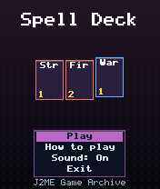
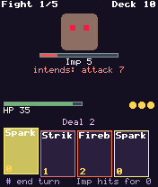
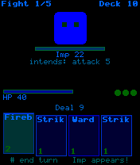

# Spell Deck

 **RPG** &middot; Game 088 of 100 &middot; v1.0.0

> A pocket deck-building duel: draw four spells, spend three mana, read the foe's intent and grow your deck after each win.

<p>  </p>

<sub>Screenshots at 176x208, captured from the real JAR on the project's reference runtime.</sub>

## About

Fight through five foes with a ten-card starter deck. Every turn you draw four spell cards and have three mana to spend on strikes, fireballs, wards, heals, life drains and freezing frost. Each enemy telegraphs its next move, so you know when to block and when to go all in. Beat a foe and pick one of three new cards to add to your deck before the next battle.

**Objective:** Defeat all five foes, ending with the Lich King.

## Controls

| Key | Action |
|---|---|
| 4/6 | Choose card |
| 5 | Cast card |
| #/0 | End turn |
| * | Pause menu |

Every game also supports: `5` to select in menus, `*` to pause, `0` on the title screen to toggle sound, and `#` on the title screen for help. Joystick/D-pad and the 2/4/6/8 keys are interchangeable.

## Download

| File | Link |
|---|---|
| JAR (install this) | [SpellDeck.jar](https://github.com/agneay/j2me-100-games/releases/download/game-088-v1.0.0/SpellDeck.jar) |
| JAD (descriptor for OTA install) | [SpellDeck.jad](https://github.com/agneay/j2me-100-games/releases/download/game-088-v1.0.0/SpellDeck.jad) |
| Release page | [game-088-v1.0.0](https://github.com/agneay/j2me-100-games/releases/tag/game-088-v1.0.0) |
| All 100 games | [j2me-100-games-v1.0.0.zip](https://github.com/agneay/j2me-100-games/releases/download/v1.0.0/j2me-100-games-v1.0.0.zip) |

**Browser Demo:** [play in your browser](https://agneay.github.io/j2me-100-games/games/spell-deck/). The browser demo is the same Java source compiled to JavaScript with TeaVM and run on the project's MIDP reference runtime; it is a convenience preview, not the original Java ME version. For the authentic experience install the JAR on a phone or in an emulator.

Installation help: [docs/installing.md](../../docs/installing.md) and [docs/emulator.md](../../docs/emulator.md).

## Technical details

| | |
|---|---|
| MIDlet class | `spelldeck.SpellDeckMIDlet` |
| Platform | Java ME, CLDC 1.0, MIDP 2.0 |
| JAR size | 18.8 KB |
| Designed for | 128x128, 128x160, 176x208, 176x220, 240x320 |
| Storage | RMS record store `gk` (settings and best score) |
| Floating point | none (integer maths only) |

## Verification

| Level | Status |
|---|---|
| Build verified | Yes: compiled against the CLDC 1.0 / MIDP 2.0 API, JAR + JAD generated |
| Reference runtime | Passed at 128x128, 128x160, 176x208, 176x220, 240x320 (automated, project's headless MIDP runtime) |
| Emulator verified | Yes: automated smoke test on MicroEmulator 2.0.4 (176x220) |
| Real device verified | Not yet tested on real hardware |

Tested it on a real phone? Please [report it](https://github.com/agneay/j2me-100-games/issues/new?template=device-report.yml) so this table can be updated honestly.

## Build from source

```bash
python tools/bootstrap.py
tools/build-game.sh 088
```

Output: `games/088-spell-deck/dist/SpellDeck.jar` and `.jad`. See [docs/building.md](../../docs/building.md).

---

Part of [J2ME 100 Games](../../README.md). Original game, released under the [MIT License](../../LICENSE).
