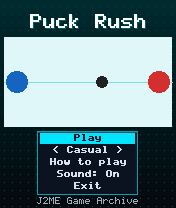
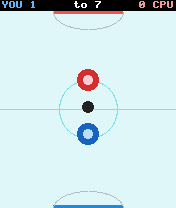
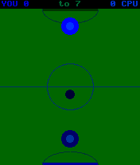

# Puck Rush

 **Sports** &middot; Game 089 of 100 &middot; v1.0.0

> Fast table air hockey against a CPU opponent: slide your mallet, bank off the rails and score first to seven.

<p>  </p>

<sub>Screenshots at 176x208, captured from the real JAR on the project's reference runtime.</sub>

## About

An arcade air-hockey table squeezed onto a phone screen. Drive your mallet around your half with the joystick or the 1/3/7/9 diagonals; a mallet in motion transfers its speed to the puck, so swing through your shots. The CPU chases loose pucks in its half and falls back to guard its goal. Casual and Pro modes change how fast the CPU reacts.

**Objective:** Score seven goals before the CPU does.

**Modes:** Casual, Pro

## Controls

| Key | Action |
|---|---|
| 2/4/6/8 | Move mallet |
| 1/3/7/9 | Move diagonally |
| * | Pause menu |

Every game also supports: `5` to select in menus, `*` to pause, `0` on the title screen to toggle sound, and `#` on the title screen for help. Joystick/D-pad and the 2/4/6/8 keys are interchangeable.

## Download

| File | Link |
|---|---|
| JAR (install this) | [PuckRush.jar](https://github.com/agneay/j2me-100-games/releases/download/game-089-v1.0.0/PuckRush.jar) |
| JAD (descriptor for OTA install) | [PuckRush.jad](https://github.com/agneay/j2me-100-games/releases/download/game-089-v1.0.0/PuckRush.jad) |
| Release page | [game-089-v1.0.0](https://github.com/agneay/j2me-100-games/releases/tag/game-089-v1.0.0) |
| All 100 games | [j2me-100-games-v1.0.0.zip](https://github.com/agneay/j2me-100-games/releases/download/v1.0.0/j2me-100-games-v1.0.0.zip) |

**Browser Demo:** [play in your browser](https://agneay.github.io/j2me-100-games/games/puck-rush/). The browser demo is the same Java source compiled to JavaScript with TeaVM and run on the project's MIDP reference runtime; it is a convenience preview, not the original Java ME version. For the authentic experience install the JAR on a phone or in an emulator.

Installation help: [docs/installing.md](../../docs/installing.md) and [docs/emulator.md](../../docs/emulator.md).

## Technical details

| | |
|---|---|
| MIDlet class | `puckrush.PuckRushMIDlet` |
| Platform | Java ME, CLDC 1.0, MIDP 2.0 |
| JAR size | 17.2 KB |
| Designed for | 128x128, 128x160, 176x208, 176x220, 240x320 |
| Storage | RMS record store `gk` (settings and best score) |
| Floating point | none (integer maths only) |

## Verification

| Level | Status |
|---|---|
| Build verified | Yes: compiled against the CLDC 1.0 / MIDP 2.0 API, JAR + JAD generated |
| Reference runtime | Passed at 128x128, 128x160, 176x208, 176x220, 240x320 (automated, project's headless MIDP runtime) |
| Emulator verified | Yes: automated smoke test on MicroEmulator 2.0.4 (176x220) |
| Real device verified | Not yet tested on real hardware |

Tested it on a real phone? Please [report it](https://github.com/agneay/j2me-100-games/issues/new?template=device-report.yml) so this table can be updated honestly.

## Build from source

```bash
python tools/bootstrap.py
tools/build-game.sh 089
```

Output: `games/089-puck-rush/dist/PuckRush.jar` and `.jad`. See [docs/building.md](../../docs/building.md).

---

Part of [J2ME 100 Games](../../README.md). Original game, released under the [MIT License](../../LICENSE).
