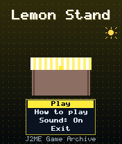
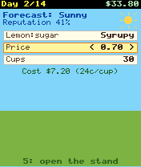
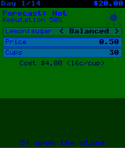

# Lemon Stand

 **Simulation** &middot; Game 090 of 100 &middot; v1.0.0

> Run a lemonade stand for fourteen days: read the forecast, tune your recipe, price and batch size, and build a reputation.

<p>  </p>

<sub>Screenshots at 176x208, captured from the real JAR on the project's reference runtime.</sub>

## About

A bite-sized business sim. Every morning brings a weather forecast; you choose how sweet to make the lemonade, what to charge and how many cups to prepare before opening. Hot days and heatwaves bring crowds, rain keeps them home, and the forecast is not always right. Balanced lemonade at a fair price grows your reputation and your future customer count, while unsold cups are poured away at the end of the day.

**Objective:** Finish the fourteenth day with as much cash as possible.

## Controls

| Key | Action |
|---|---|
| 2/8 | Choose setting |
| 4/6 | Change value |
| 5 | Open stand / next day |
| * | Pause menu |

Every game also supports: `5` to select in menus, `*` to pause, `0` on the title screen to toggle sound, and `#` on the title screen for help. Joystick/D-pad and the 2/4/6/8 keys are interchangeable.

## Download

| File | Link |
|---|---|
| JAR (install this) | [LemonStand.jar](https://github.com/agneay/j2me-100-games/releases/download/game-090-v1.0.0/LemonStand.jar) |
| JAD (descriptor for OTA install) | [LemonStand.jad](https://github.com/agneay/j2me-100-games/releases/download/game-090-v1.0.0/LemonStand.jad) |
| Release page | [game-090-v1.0.0](https://github.com/agneay/j2me-100-games/releases/tag/game-090-v1.0.0) |
| All 100 games | [j2me-100-games-v1.0.0.zip](https://github.com/agneay/j2me-100-games/releases/download/v1.0.0/j2me-100-games-v1.0.0.zip) |

**Browser Demo:** [play in your browser](https://agneay.github.io/j2me-100-games/games/lemon-stand/). The browser demo is the same Java source compiled to JavaScript with TeaVM and run on the project's MIDP reference runtime; it is a convenience preview, not the original Java ME version. For the authentic experience install the JAR on a phone or in an emulator.

Installation help: [docs/installing.md](../../docs/installing.md) and [docs/emulator.md](../../docs/emulator.md).

## Technical details

| | |
|---|---|
| MIDlet class | `lemonstand.LemonStandMIDlet` |
| Platform | Java ME, CLDC 1.0, MIDP 2.0 |
| JAR size | 18.9 KB |
| Designed for | 128x128, 128x160, 176x208, 176x220, 240x320 |
| Storage | RMS record store `gk` (settings and best score) |
| Floating point | none (integer maths only) |

## Verification

| Level | Status |
|---|---|
| Build verified | Yes: compiled against the CLDC 1.0 / MIDP 2.0 API, JAR + JAD generated |
| Reference runtime | Passed at 128x128, 128x160, 176x208, 176x220, 240x320 (automated, project's headless MIDP runtime) |
| Emulator verified | Yes: automated smoke test on MicroEmulator 2.0.4 (176x220) |
| Real device verified | Not yet tested on real hardware |

Tested it on a real phone? Please [report it](https://github.com/agneay/j2me-100-games/issues/new?template=device-report.yml) so this table can be updated honestly.

## Build from source

```bash
python tools/bootstrap.py
tools/build-game.sh 090
```

Output: `games/090-lemon-stand/dist/LemonStand.jar` and `.jad`. See [docs/building.md](../../docs/building.md).

---

Part of [J2ME 100 Games](../../README.md). Original game, released under the [MIT License](../../LICENSE).
