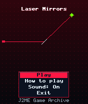
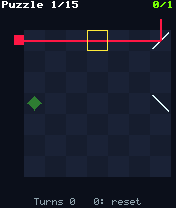
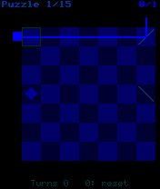

# Laser Mirrors

 **Puzzle** &middot; Game 092 of 100 &middot; v1.0.0

> Rotate mirrors to bounce a laser beam through every crystal; fifteen generated puzzles with walls, decoys and bolted mirrors.

<p>  </p>

<sub>Screenshots at 176x208, captured from the real JAR on the project's reference runtime.</sub>

## About

A laser fires in from the left wall of a 7x7 board. Move the cursor onto a mirror and press 5 to flip it between its two diagonals, steering the beam until it passes through every target crystal. Later puzzles add stone blocks that stop the beam, decoy mirrors and mirrors bolted in place. Each puzzle is built from a real beam path, so a solution always exists; fewer rotations earn more points.

**Objective:** Light every crystal in all fifteen puzzles.

## Controls

| Key | Action |
|---|---|
| 2/4/6/8 | Move cursor |
| 5 | Rotate mirror |
| 0 | Reset puzzle |
| * | Pause menu |

Every game also supports: `5` to select in menus, `*` to pause, `0` on the title screen to toggle sound, and `#` on the title screen for help. Joystick/D-pad and the 2/4/6/8 keys are interchangeable.

## Download

| File | Link |
|---|---|
| JAR (install this) | [LaserMirrors.jar](https://github.com/agneay/j2me-100-games/releases/download/game-092-v1.0.0/LaserMirrors.jar) |
| JAD (descriptor for OTA install) | [LaserMirrors.jad](https://github.com/agneay/j2me-100-games/releases/download/game-092-v1.0.0/LaserMirrors.jad) |
| Release page | [game-092-v1.0.0](https://github.com/agneay/j2me-100-games/releases/tag/game-092-v1.0.0) |
| All 100 games | [j2me-100-games-v1.0.0.zip](https://github.com/agneay/j2me-100-games/releases/download/v1.0.0/j2me-100-games-v1.0.0.zip) |

**Browser Demo:** [play in your browser](https://agneay.github.io/j2me-100-games/games/laser-mirrors/). The browser demo is the same Java source compiled to JavaScript with TeaVM and run on the project's MIDP reference runtime; it is a convenience preview, not the original Java ME version. For the authentic experience install the JAR on a phone or in an emulator.

Installation help: [docs/installing.md](../../docs/installing.md) and [docs/emulator.md](../../docs/emulator.md).

## Technical details

| | |
|---|---|
| MIDlet class | `lasermirrors.LaserMirrorsMIDlet` |
| Platform | Java ME, CLDC 1.0, MIDP 2.0 |
| JAR size | 18.2 KB |
| Designed for | 128x128, 128x160, 176x208, 176x220, 240x320 |
| Storage | RMS record store `gk` (settings and best score) |
| Floating point | none (integer maths only) |

## Verification

| Level | Status |
|---|---|
| Build verified | Yes: compiled against the CLDC 1.0 / MIDP 2.0 API, JAR + JAD generated |
| Reference runtime | Passed at 128x128, 128x160, 176x208, 176x220, 240x320 (automated, project's headless MIDP runtime) |
| Emulator verified | Yes: automated smoke test on MicroEmulator 2.0.4 (176x220) |
| Real device verified | Not yet tested on real hardware |

Tested it on a real phone? Please [report it](https://github.com/agneay/j2me-100-games/issues/new?template=device-report.yml) so this table can be updated honestly.

## Build from source

```bash
python tools/bootstrap.py
tools/build-game.sh 092
```

Output: `games/092-laser-mirrors/dist/LaserMirrors.jar` and `.jad`. See [docs/building.md](../../docs/building.md).

---

Part of [J2ME 100 Games](../../README.md). Original game, released under the [MIT License](../../LICENSE).
