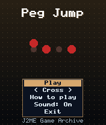
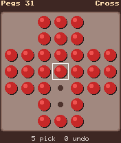
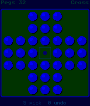

# Peg Jump

 **Puzzle** &middot; Game 093 of 100 &middot; v1.0.0

> Peg solitaire on three boards: jump pegs over each other until only one remains, with unlimited undo.

<p>  </p>

<sub>Screenshots at 176x208, captured from the real JAR on the project's reference runtime.</sub>

## About

The old wooden-board puzzle in your pocket. Pick up a peg with 5, then press a direction to jump it over a neighbour into an empty hole, removing the peg you jumped. Play the classic 33-hole cross, a smaller diamond, or a 15-hole triangle where diagonal jumps along the slope are allowed. Press 0 to undo as far back as you like. Fewer pegs left is better; a single peg in the centre of the cross is the master finish.

**Objective:** Leave as few pegs on the board as possible, ideally just one.

**Modes:** Cross, Diamond, Triangle

## Controls

| Key | Action |
|---|---|
| 2/4/6/8 | Move cursor / jump direction |
| 5 | Pick up or drop peg |
| 1/9 | Diagonal jump (Triangle) |
| 0 | Undo |
| * | Pause menu |

Every game also supports: `5` to select in menus, `*` to pause, `0` on the title screen to toggle sound, and `#` on the title screen for help. Joystick/D-pad and the 2/4/6/8 keys are interchangeable.

## Download

| File | Link |
|---|---|
| JAR (install this) | [PegJump.jar](https://github.com/agneay/j2me-100-games/releases/download/game-093-v1.0.0/PegJump.jar) |
| JAD (descriptor for OTA install) | [PegJump.jad](https://github.com/agneay/j2me-100-games/releases/download/game-093-v1.0.0/PegJump.jad) |
| Release page | [game-093-v1.0.0](https://github.com/agneay/j2me-100-games/releases/tag/game-093-v1.0.0) |
| All 100 games | [j2me-100-games-v1.0.0.zip](https://github.com/agneay/j2me-100-games/releases/download/v1.0.0/j2me-100-games-v1.0.0.zip) |

**Browser Demo:** [play in your browser](https://agneay.github.io/j2me-100-games/games/peg-jump/). The browser demo is the same Java source compiled to JavaScript with TeaVM and run on the project's MIDP reference runtime; it is a convenience preview, not the original Java ME version. For the authentic experience install the JAR on a phone or in an emulator.

Installation help: [docs/installing.md](../../docs/installing.md) and [docs/emulator.md](../../docs/emulator.md).

## Technical details

| | |
|---|---|
| MIDlet class | `pegjump.PegJumpMIDlet` |
| Platform | Java ME, CLDC 1.0, MIDP 2.0 |
| JAR size | 17.7 KB |
| Designed for | 128x128, 128x160, 176x208, 176x220, 240x320 |
| Storage | RMS record store `gk` (settings and best score) |
| Floating point | none (integer maths only) |

## Verification

| Level | Status |
|---|---|
| Build verified | Yes: compiled against the CLDC 1.0 / MIDP 2.0 API, JAR + JAD generated |
| Reference runtime | Passed at 128x128, 128x160, 176x208, 176x220, 240x320 (automated, project's headless MIDP runtime) |
| Emulator verified | Yes: automated smoke test on MicroEmulator 2.0.4 (176x220) |
| Real device verified | Not yet tested on real hardware |

Tested it on a real phone? Please [report it](https://github.com/agneay/j2me-100-games/issues/new?template=device-report.yml) so this table can be updated honestly.

## Build from source

```bash
python tools/bootstrap.py
tools/build-game.sh 093
```

Output: `games/093-peg-jump/dist/PegJump.jar` and `.jad`. See [docs/building.md](../../docs/building.md).

---

Part of [J2ME 100 Games](../../README.md). Original game, released under the [MIT License](../../LICENSE).
