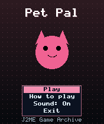
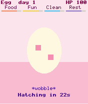
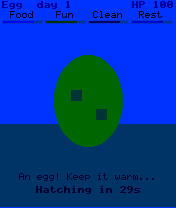

# Pet Pal

 **Simulation** &middot; Game 095 of 100 &middot; v1.0.0

> Hatch an egg and raise a pixel pet to adulthood: feed it, play with it, clean up and tuck it in.

<p>  </p>

<sub>Screenshots at 176x208, captured from the real JAR on the project's reference runtime.</sub>

## About

A pocket virtual pet that grows up in about four minutes. Watch an egg hatch, then keep four needs topped up - food, fun, cleanliness and rest - while your pet grows from baby to child, teen and adult. Neglect costs health, messes make it sick and medicine cures it, but overfeeding and needless medicine do harm. Playtime is a quick left-or-right guessing game. A well cared for pet becomes a special happy adult.

**Objective:** Raise your pet to adulthood in good health.

## Controls

| Key | Action |
|---|---|
| 4/6 | Choose action |
| 5 | Do action |
| 4/6 in play | Guess left / right |
| * | Pause menu |

Every game also supports: `5` to select in menus, `*` to pause, `0` on the title screen to toggle sound, and `#` on the title screen for help. Joystick/D-pad and the 2/4/6/8 keys are interchangeable.

## Download

| File | Link |
|---|---|
| JAR (install this) | [PetPal.jar](https://github.com/agneay/j2me-100-games/releases/download/game-095-v1.0.0/PetPal.jar) |
| JAD (descriptor for OTA install) | [PetPal.jad](https://github.com/agneay/j2me-100-games/releases/download/game-095-v1.0.0/PetPal.jad) |
| Release page | [game-095-v1.0.0](https://github.com/agneay/j2me-100-games/releases/tag/game-095-v1.0.0) |
| All 100 games | [j2me-100-games-v1.0.0.zip](https://github.com/agneay/j2me-100-games/releases/download/v1.0.0/j2me-100-games-v1.0.0.zip) |

**Browser Demo:** [play in your browser](https://agneay.github.io/j2me-100-games/games/pet-pal/). The browser demo is the same Java source compiled to JavaScript with TeaVM and run on the project's MIDP reference runtime; it is a convenience preview, not the original Java ME version. For the authentic experience install the JAR on a phone or in an emulator.

Installation help: [docs/installing.md](../../docs/installing.md) and [docs/emulator.md](../../docs/emulator.md).

## Technical details

| | |
|---|---|
| MIDlet class | `petpal.PetPalMIDlet` |
| Platform | Java ME, CLDC 1.0, MIDP 2.0 |
| JAR size | 18.7 KB |
| Designed for | 128x128, 128x160, 176x208, 176x220, 240x320 |
| Storage | RMS record store `gk` (settings and best score) |
| Floating point | none (integer maths only) |

## Verification

| Level | Status |
|---|---|
| Build verified | Yes: compiled against the CLDC 1.0 / MIDP 2.0 API, JAR + JAD generated |
| Reference runtime | Passed at 128x128, 128x160, 176x208, 176x220, 240x320 (automated, project's headless MIDP runtime) |
| Emulator verified | Yes: automated smoke test on MicroEmulator 2.0.4 (176x220) |
| Real device verified | Not yet tested on real hardware |

Tested it on a real phone? Please [report it](https://github.com/agneay/j2me-100-games/issues/new?template=device-report.yml) so this table can be updated honestly.

## Build from source

```bash
python tools/bootstrap.py
tools/build-game.sh 095
```

Output: `games/095-pet-pal/dist/PetPal.jar` and `.jad`. See [docs/building.md](../../docs/building.md).

---

Part of [J2ME 100 Games](../../README.md). Original game, released under the [MIT License](../../LICENSE).
