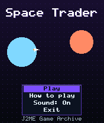
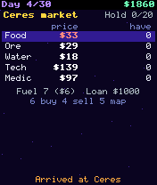
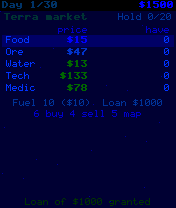

# Space Trader

 **Simulation** &middot; Game 096 of 100 &middot; v1.0.0

> Buy low and sell high across six worlds in thirty days, dodging pirates and chasing price spikes to pay off your loan.

<p>  </p>

<sub>Screenshots at 176x208, captured from the real JAR on the project's reference runtime.</sub>

## About

A compact space trading sim. Every planet produces some goods cheaply and pays a premium for others, prices drift each day, and news of shortages and gluts can double or halve a market. Fill your hold, plot a course on the star map, and watch your fuel: longer hops cost more days and more fuel, and fuel is cheaper on the outer moons. Pirates may raid your cargo on arrival. Expand your hold when you can afford it, and finish day thirty with as much money as possible after repaying the loan.

**Objective:** End day 30 with the highest net worth after repaying your loan.

## Controls

| Key | Action |
|---|---|
| 2/8 | Choose good |
| 6 | Buy one |
| 4 | Sell one |
| 3 | Buy max |
| 1 | Sell all |
| 5 | Star map / travel |
| 0 | Buy fuel (map: back) |
| 9 | Upgrade hold |
| * | Pause menu |

Every game also supports: `5` to select in menus, `*` to pause, `0` on the title screen to toggle sound, and `#` on the title screen for help. Joystick/D-pad and the 2/4/6/8 keys are interchangeable.

## Download

| File | Link |
|---|---|
| JAR (install this) | [SpaceTrader.jar](https://github.com/agneay/j2me-100-games/releases/download/game-096-v1.0.0/SpaceTrader.jar) |
| JAD (descriptor for OTA install) | [SpaceTrader.jad](https://github.com/agneay/j2me-100-games/releases/download/game-096-v1.0.0/SpaceTrader.jad) |
| Release page | [game-096-v1.0.0](https://github.com/agneay/j2me-100-games/releases/tag/game-096-v1.0.0) |
| All 100 games | [j2me-100-games-v1.0.0.zip](https://github.com/agneay/j2me-100-games/releases/download/v1.0.0/j2me-100-games-v1.0.0.zip) |

**Browser Demo:** [play in your browser](https://agneay.github.io/j2me-100-games/games/space-trader/). The browser demo is the same Java source compiled to JavaScript with TeaVM and run on the project's MIDP reference runtime; it is a convenience preview, not the original Java ME version. For the authentic experience install the JAR on a phone or in an emulator.

Installation help: [docs/installing.md](../../docs/installing.md) and [docs/emulator.md](../../docs/emulator.md).

## Technical details

| | |
|---|---|
| MIDlet class | `spacetrader.SpaceTraderMIDlet` |
| Platform | Java ME, CLDC 1.0, MIDP 2.0 |
| JAR size | 18.7 KB |
| Designed for | 128x128, 128x160, 176x208, 176x220, 240x320 |
| Storage | RMS record store `gk` (settings and best score) |
| Floating point | none (integer maths only) |

## Verification

| Level | Status |
|---|---|
| Build verified | Yes: compiled against the CLDC 1.0 / MIDP 2.0 API, JAR + JAD generated |
| Reference runtime | Passed at 128x128, 128x160, 176x208, 176x220, 240x320 (automated, project's headless MIDP runtime) |
| Emulator verified | Yes: automated smoke test on MicroEmulator 2.0.4 (176x220) |
| Real device verified | Not yet tested on real hardware |

Tested it on a real phone? Please [report it](https://github.com/agneay/j2me-100-games/issues/new?template=device-report.yml) so this table can be updated honestly.

## Build from source

```bash
python tools/bootstrap.py
tools/build-game.sh 096
```

Output: `games/096-space-trader/dist/SpaceTrader.jar` and `.jad`. See [docs/building.md](../../docs/building.md).

---

Part of [J2ME 100 Games](../../README.md). Original game, released under the [MIT License](../../LICENSE).
