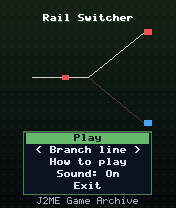
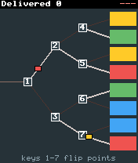
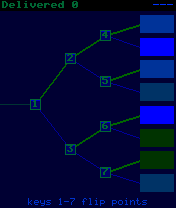

# Rail Switcher

 **Experimental** &middot; Game 097 of 100 &middot; v1.0.0

> The keypad is a signal box: flip seven sets of points with keys 1-7 to route coloured trains to matching stations.

<p>  </p>

<sub>Screenshots at 176x208, captured from the real JAR on the project's reference runtime.</sub>

## About

An experiment in using the number pad as a control panel. A branching railway fans out from a single line into eight coloured stations, with seven sets of points along the way, and each point is mapped to one number key. Trains roll in from the left one after another; flip the points ahead of them so every train ends up at a station of its own colour. Trains speed up and arrive closer together as you deliver more, and three wrong deliveries end your shift.

**Objective:** Deliver as many trains as possible before making three mistakes.

**Modes:** Branch line, Main line

## Controls

| Key | Action |
|---|---|
| 1-7 | Flip a set of points |
| * | Pause menu |

Every game also supports: `5` to select in menus, `*` to pause, `0` on the title screen to toggle sound, and `#` on the title screen for help. Joystick/D-pad and the 2/4/6/8 keys are interchangeable.

## Download

| File | Link |
|---|---|
| JAR (install this) | [RailSwitcher.jar](https://github.com/agneay/j2me-100-games/releases/download/game-097-v1.0.0/RailSwitcher.jar) |
| JAD (descriptor for OTA install) | [RailSwitcher.jad](https://github.com/agneay/j2me-100-games/releases/download/game-097-v1.0.0/RailSwitcher.jad) |
| Release page | [game-097-v1.0.0](https://github.com/agneay/j2me-100-games/releases/tag/game-097-v1.0.0) |
| All 100 games | [j2me-100-games-v1.0.0.zip](https://github.com/agneay/j2me-100-games/releases/download/v1.0.0/j2me-100-games-v1.0.0.zip) |

**Browser Demo:** [play in your browser](https://agneay.github.io/j2me-100-games/games/rail-switcher/). The browser demo is the same Java source compiled to JavaScript with TeaVM and run on the project's MIDP reference runtime; it is a convenience preview, not the original Java ME version. For the authentic experience install the JAR on a phone or in an emulator.

Installation help: [docs/installing.md](../../docs/installing.md) and [docs/emulator.md](../../docs/emulator.md).

## Technical details

| | |
|---|---|
| MIDlet class | `railswitcher.RailSwitcherMIDlet` |
| Platform | Java ME, CLDC 1.0, MIDP 2.0 |
| JAR size | 17.2 KB |
| Designed for | 128x128, 128x160, 176x208, 176x220, 240x320 |
| Storage | RMS record store `gk` (settings and best score) |
| Floating point | none (integer maths only) |

## Verification

| Level | Status |
|---|---|
| Build verified | Yes: compiled against the CLDC 1.0 / MIDP 2.0 API, JAR + JAD generated |
| Reference runtime | Passed at 128x128, 128x160, 176x208, 176x220, 240x320 (automated, project's headless MIDP runtime) |
| Emulator verified | Yes: automated smoke test on MicroEmulator 2.0.4 (176x220) |
| Real device verified | Not yet tested on real hardware |

Tested it on a real phone? Please [report it](https://github.com/agneay/j2me-100-games/issues/new?template=device-report.yml) so this table can be updated honestly.

## Build from source

```bash
python tools/bootstrap.py
tools/build-game.sh 097
```

Output: `games/097-rail-switcher/dist/RailSwitcher.jar` and `.jad`. See [docs/building.md](../../docs/building.md).

---

Part of [J2ME 100 Games](../../README.md). Original game, released under the [MIT License](../../LICENSE).
